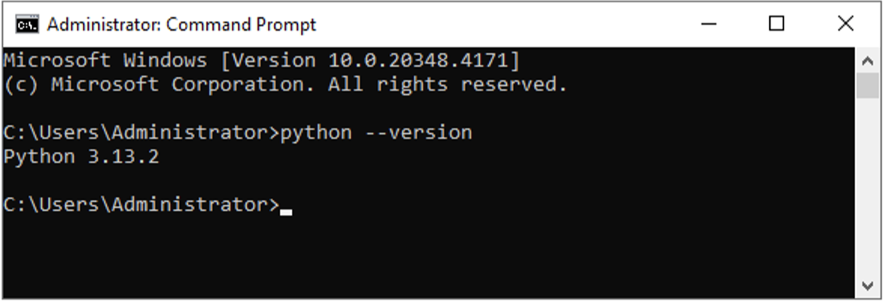
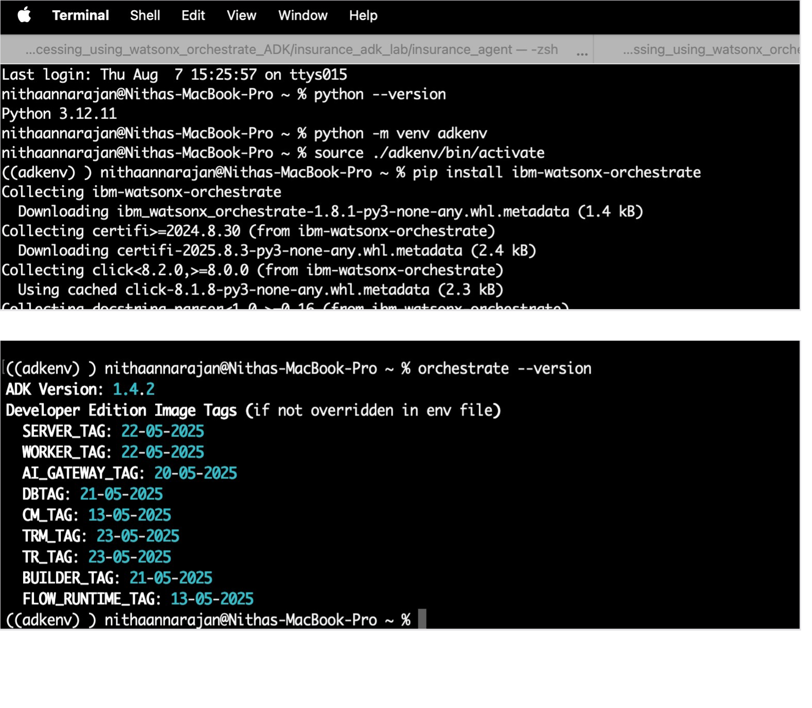
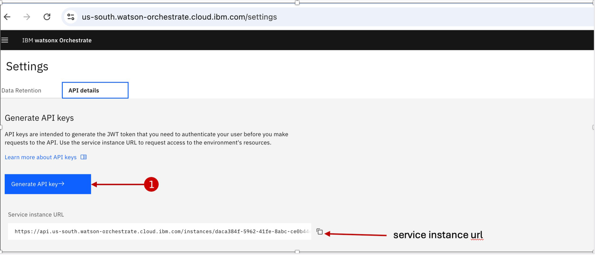
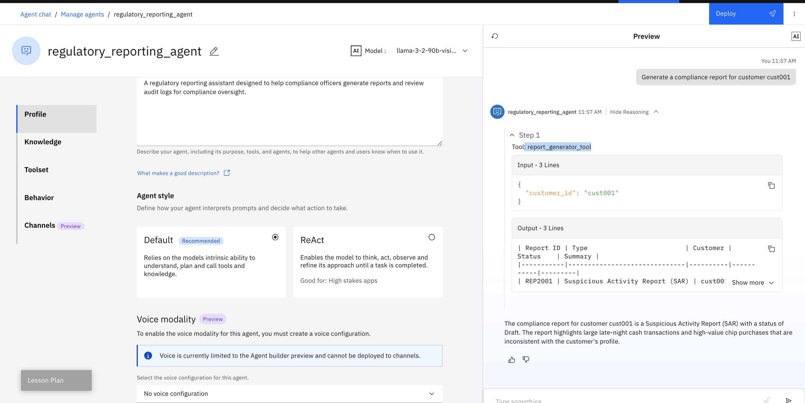
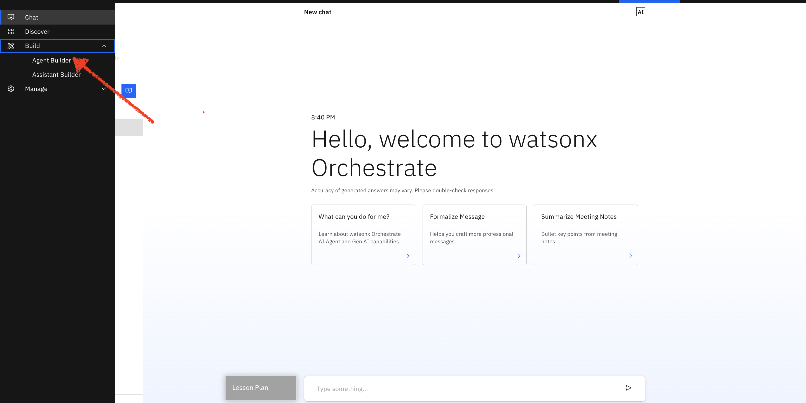
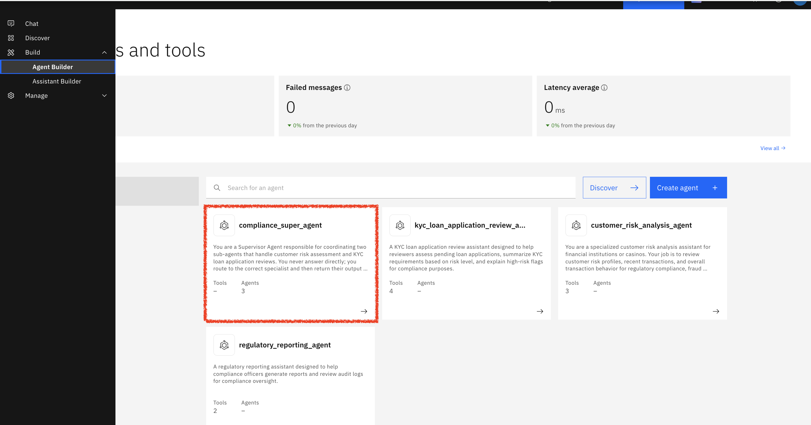
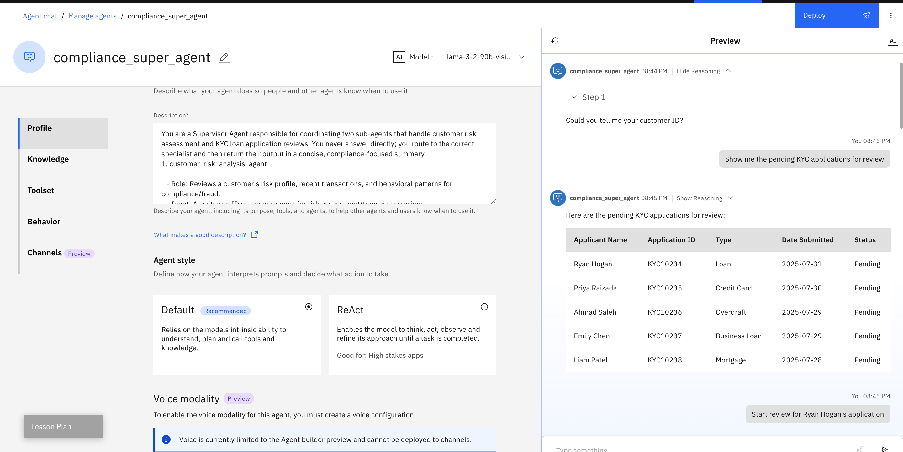
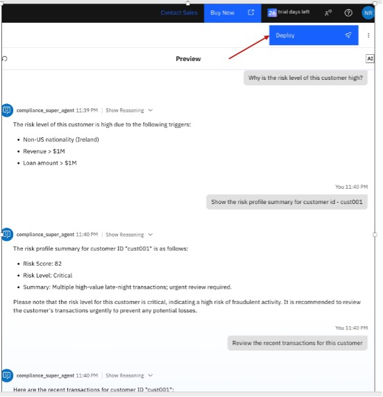
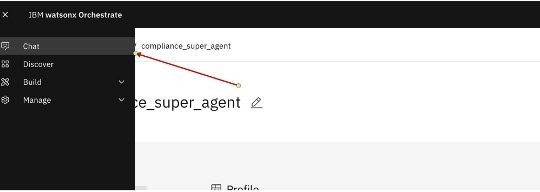
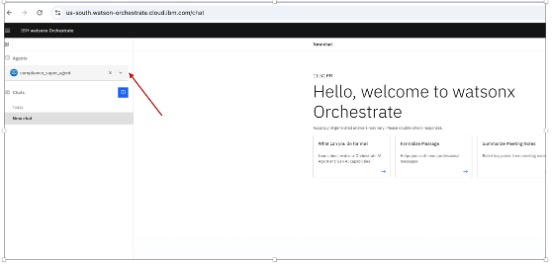

### **KYC Agent: Automate verification, risk profiling, and monitoring with Agentic AI**

# Learning Objective

Time Required : 90 Mins

You will acquire practical, hands-on experience building and deploying intelligent KYC agents using Watsonx Orchestrate Developer Edition and the Agent Development Kit (ADK). Specifically, you will be able to:

# KYC Agent: Automate Verification, Risk Profiling, and Monitoring with Agentic AI

## Learning Objectives

* **Design and deploy KYC agents** on your local machine using the Watsonx Orchestrate Developer Edition bundled with the ADK, enabling rapid iteration in an isolated dev environment before moving to production.  

* **Build and integrate custom tools** using the ADK framework that fetch, validate, and process customer identity data in real time from both internal systems and external data sources to automate verification, profiling, and continuous monitoring workflows.  

* **Build conversational experiences** using the built-in Watsonx Assistant within Watsonx Orchestrate to enable natural language interactions for:
  - Querying KYC verification results  
  - Reviewing customer risk profiles  
  - Performing real-time monitoring of customer activity and compliance indicators  

* **Use modular, low-code orchestration with ADK** to stitch together workflows that combine tools, conditional logic, LLMs, and prompts to deliver seamless KYC automation.  

* **Apply these skills to real-world KYC use cases** by streamlining onboarding, ensuring ongoing risk monitoring, and improving compliance efficiency through end-to-end intelligent automation.  

---

## The Problem

**FinTrust Bank**, a mid-sized financial services provider, is experiencing growing inefficiencies in its customer onboarding and compliance processes.  

- The current manual approach to KYC verification and customer monitoring is not scalable, leading to delays and increased operational risks.  
- There is no unified mechanism for continuous customer risk profiling and monitoring.  
- This results in delayed compliance checks, missed red flags, and increased operational costs.  

With rising regulatory pressure and an expanding customer base, the bank requires an **automated solution** to:  
- Streamline verification  
- Enable real-time risk insights  
- Maintain audit-ready compliance  


**Key Challenges:**

*   KYC verification is manual and time-consuming, slowing down customer onboarding timelines.
*   Inconsistent processes across regions result in compliance gaps and operational inefficiencies.
*   No centralized system for continuous customer risk profiling and monitoring
*   Delays in detecting high-risk profiles or anomalies due to lack of real-time insights.
*   High operational effort and cost due to dependence on manual reviews.
*   Difficulty in maintaining audit trails and ensuring readiness for regulatory checks.

An intelligent, autonomous KYC Agent equipped with purpose-built tools such as identity verification, document extraction, customer profiling, and risk scoring can transform this process. By automating repetitive compliance tasks and enabling realtime access to customer data, the agent can provide faster onboarding, reduce operational effort, and ensure consistent adherence to regulatory standards. This approach also enhances decision-making by delivering proactive risk insights and eliminating the delays caused by manual review cycles.

# Objective

**FinTrust** Bank plans to implement an AI-powered KYC Agent to support compliance and risk teams in continuously monitoring and managing customer risk profiles. The goal is to build an agentic AI solution that intelligently orchestrates KYC verification, transaction monitoring, and risk scoring systems to deliver proactive, real-time compliance insights. The KYC Agent will assist teams in executing the following tasks:

*   Retrieve and validate customer identity data from internal and external sources
*   Automate KYC checks including document verification, watchlist screening, and name matching.
*   Monitor customer behavior and transactions to identify anomalies or compliance risks.
*   Assess and update customer risk profiles in real time based on evolving data.
*   Provide contextual summaries and remediation suggestions to support faster decision-making

By automating these processes, the bank aims to reduce manual workload, improve compliance accuracy, and ensure consistent, audit-ready monitoring across the customer lifecycle.

# Business Value

*   **Accelerates customer onboarding** by removing manual steps and reducing delays.
*   **Improves operational efficiency** by minimizing repetitive tasks and manual follow-ups.
*   **Ensures up-to-date risk profiles**, helping teams stay audit-ready and compliant.
*   **Supports real-time risk detection**, enabling early identification of red flags in customer behaviour.

# Architecture


# Pre-requisites

*   Check with your instructor to make sure **all systems** are up and running before you continue.
*   Validate that you have access to the right techzone environment for this lab.
*   Validate that you have access to a credentials file that you instructor will share with you before starting the labs.

# Accessing Your Watsonx Orchestrate Instance

*   A TechZone environment has been reserved for you, and you will receive the access details via email.
*   To access your Watsonx Orchestrate instance, **please check with your instructor** for the access link and the necessary steps.

# Getting Started with the Agent Development Kit (ADK)

The **Agent Development Kit (ADK)** is a set of tools that helps you build, test, and manage AI agents for watsonx Orchestrate. It gives developers full control using a simple CLI and a lightweight framework.

With ADK, you can:

*   Define agents using YAML or JSON Create custom tools in Python
*   Run and manage agents with just a few commands In this bootcamp, you’ll:
*   Set up your local environment Install the ADK
*   Deploy your first agent to a watsonx Orchestrate instance

## Before You Begin

Before proceeding, ensure the following requirements are met:

**1. Python**

**Version:** Python 3.12 or later
**Check version:** python3.12 --version

**Check version:**

```bash
python3 --version
```




# From ADK Installation to Agent Testing: Step-by-Step Setup Guide

You can install the ADK either directly on your system or inside a virtual environment. Installing it system-wide makes it available to all your Python projects, but using a virtual environment gives you better control over your setup and makes it easier to manage and share your agents and tools.

**In this bootcamp, we will install the ADK inside a virtual environment** to keep things clean, organized, and easy to manage.

Follow the steps below to get started with the virtual environment setup.

## 1\. Installing ADK

Open your **terminal** to run the commands below.

**a. Create your virtual environment**

```python
python -m venv adkenv
```

### b. Activate your virtual environment

```python
source ./adkenv/bin/activate
```

**c. Install the ADK with the following command:**

```python
pip install ibm-watsonx-orchestrate
```

## Troubleshooting Common Issues

# If you get the ADK installation error about Python version:

### Python Version Problems
```bash
# Error: Could not find a version that satisfies the requirement ibm-watsonx-orchestrate
# Solution: Use Python 3.12+
deactivate
rm -rf adkenv
python3.12 -m venv adkenv
source ./adkenv/bin/activate
pip install ibm-watsonx-orchestrate
```

### Tool Import Failures
- Check Python syntax in tool files
- Verify @tool decorator is imported correctly
- Ensure requirements.txt has all dependencies

### Agent Import Issues
- Validate YAML syntax (spacing is critical)
- Check tool name references match exactly
- Verify model_id is correct

### Authentication Problems
- Double-check API key was copied correctly (no extra spaces)
- Verify Service Instance URL format
- Try regenerating API key if needed


If you face issues after installing the ADK, you may need to update it to the latest version. Once installed or updated, you can check whether the installation was successful and explore the available commands using the CLI.
```bash
pip install --upgrade ibm-watsonx-orchestrate 
```
Then run 
```bash
orchestrate --version
orchestrate –-help 
```




## 2\. Configure your environment in the ADK

Before you can start creating agents, you need to configure your **watsonx Orchestrate environment** in the ADK.

To do this, you will need **credentials** specific to your environment (such as IBM Cloud).

If you don’t have these details, **please check with your bootcamp instructor** before proceeding. (Refer the screen shots below)


When you click **Launch watsonx Orchestrate**, it will take you to the **Orchestrate landing page**.


On this page, click on **Settings** as shown in the screenshot provided.



On the **Settings** page, locate and note down the **Service Instance URL**. This URL will be required when configuring your environment in the ADK.

Next, click on **Generate API Key** to create the authentication key. Be sure to copy and securely save the API key, as it will not be displayed again.

With the credentials ready, you can add the environment by running the following command:

```bash
orchestrate env add -n <environment-name> -u <service_instance_url> --type ibm_iam --activate
```

Here’s what each part of the command means:

- `<environment-name>`: A custom name to identify this environment (e.g., `ibmcloud`, `demo-env`).
- `<service_instance_url>`: The URL of your Orchestrate service instance.
- `--type ibm_iam`: Specifies the authentication type (IBM Cloud uses `ibm_iam`).
- `--activate`: his sets the environment as the active one right after adding it Enter the API key generated in the previous step when prompted.


### Steps to Activate Your Environment and Create Tools and Agents

#### 3. Activate Your Environment
Run the following command to activate the environment you created:
```bash
orchestrate env activate <environment-name>
```
Replace `<environment-name>` with the name you used earlier when adding the environment.

# Optionally run the below commands to see if you have any existing tools, expected result should be NOTHING

```bash
orchestrate tools list
orchestrate agents list
```

#### 4. Clone the Repository and Retrieve the Code
Once your virtual environment is active and your environment is configured, clone the bootcamp repository to get the required tools and agent files:
```bash
git clone https://github.com/esantan-ibm/agentic-ai-bootcamp.git
cd customer-risk-summary
```

## Create Your Own Tool and Agent (Mandatory Student Exercise)

Now that you've cloned the repository, you will create your own tool and agent before importing the default ones. This will give you hands-on experience building from scratch.

### 1. Create Your Own Tool File

Navigate to the tools directory:
```bash
cd tools
touch regulatory_reporting_tools.py
```

### 2. Add Tool Content

Open `regulatory_reporting_tools.py` and paste the following content:

```python
from ibm_watsonx_orchestrate.agent_builder.tools import tool

# Mock compliance reports keyed by type
mock_reports = {
    "cust001": {
        "report_id": "REP2001",
        "report_type": "Suspicious Activity Report (SAR)",
        "customer_id": "cust001",
        "summary": "Large late-night cash transactions and high-value chip purchases inconsistent with profile.",
        "status": "Draft"
    },
    "cust002": {
        "report_id": "REP2002",
        "report_type": "Suspicious Activity Report (SAR)",
        "customer_id": "cust002",
        "summary": "Frequent chip redemptions and large transfers flagged for AML review.",
        "status": "Draft"
    },
    "cust003": {
        "report_id": "REP2003",
        "report_type": "Audit Summary Report",
        "customer_id": "cust003",
        "summary": "Medium risk activity with occasional spikes. No SAR required but monitoring ongoing.",
        "status": "Completed"
    },
    "cust004": {
        "report_id": "REP2004",
        "report_type": "Audit Summary Report",
        "customer_id": "cust004",
        "summary": "Low-risk transactions. No anomalies detected this period.",
        "status": "Completed"
    },
    "cust005": {
        "report_id": "REP2005",
        "report_type": "Routine Compliance Report",
        "customer_id": "cust005",
        "summary": "Minimal activity, no suspicious indicators. No SAR required.",
        "status": "Completed"
    }
}

@tool()
def report_generator_tool(customer_id: str) -> str:
    """
    Returns a formatted table with the compliance or SAR report for the given customer_id.
    """
    key = customer_id.lower()
    report = mock_reports.get(
        key,
        {
            "report_id": "REP9999",
            "report_type": "Routine Compliance Report",
            "customer_id": customer_id,
            "summary": "Customer not in database; no suspicious activity detected.",
            "status": "Completed"
        }
    )

    lines = [
        "| Report ID | Type                         | Customer | Status    | Summary |",
        "|-----------|------------------------------|----------|-----------|---------|",
        f"| {report['report_id']} | {report['report_type']} | {report['customer_id']} | {report['status']} | {report['summary']} |"
    ]
    return "\n".join(lines)


mock_audit_logs = {
    "cust001": [
        {"timestamp": "2025-07-30", "event": "SAR draft generated"},
        {"timestamp": "2025-07-29", "event": "High-value transaction flagged"},
        {"timestamp": "2025-07-27", "event": "Pattern anomaly detected"}
    ],
    "cust002": [
        {"timestamp": "2025-07-28", "event": "Chip redemption flagged"},
        {"timestamp": "2025-07-27", "event": "AML check performed"}
    ],
    "cust003": [
        {"timestamp": "2025-07-25", "event": "Transaction review completed"},
        {"timestamp": "2025-07-24", "event": "No anomalies detected"}
    ],
    "cust004": [
        {"timestamp": "2025-07-22", "event": "Low-risk customer — minimal activity"},
        {"timestamp": "2025-07-20", "event": "Routine KYC check"}
    ],
    "cust005": [
        {"timestamp": "2025-07-19", "event": "Gift shop spend logged"},
        {"timestamp": "2025-07-18", "event": "No suspicious activity"}
    ]
}

@tool()
def audit_log_search_tool(customer_id: str) -> str:
    """
    Returns a formatted table of audit log entries for the specified customer ID.
    """
    logs = mock_audit_logs.get(customer_id, [])
    if not logs:
        return f"No audit logs found for {customer_id}"

    lines = [
        "| Timestamp  | Event                          |",
        "|------------|-------------------------------|"
    ]
    for entry in logs:
        line = f"| {entry['timestamp']} | {entry['event']} |"
        lines.append(line)

    return "\n".join(lines)
```


### 3. Test the Tool Locally

```bash
python tools/regulatory_reporting_tools.py
```

There should be no output - that means no syntax errors.

### 4. Import the Tool into Watsonx Orchestrate

```bash
orchestrate tools import \
  -k python \
  -f tools/regulatory_reporting_tools.py \
  -r requirements.txt
```

### 5. Verify Tool Is Registered

```bash
orchestrate tools list
```

You should see both `report_generator_tool` and `audit_log_search_tool` listed.

### 6. Create Your Agent YAML File

Navigate to the agents directory:
```bash
cd ../agents
touch regulatory_reporting_agent.yaml
```

Add this content to `regulatory_reporting_agent.yaml`:

```yaml
spec_version: v1
style: default
name: regulatory_reporting_agent
llm: watsonx/meta-llama/llama-3-2-90b-vision-instruct
description: >
  A regulatory reporting assistant designed to help compliance officers generate reports
  and review audit logs for compliance oversight.

instructions: >
  - When asked to generate a regulatory report for a customer (e.g., "Create a report for customer cust001"),
    use only the `report_generator_tool` to list the structured report and provide a compliance-focused summary.
  - Do not ask the user to specify report types; the tool determines whether the report is a SAR, Audit, or Routine Compliance Report.
  - When asked to review or cross-check past activities (e.g., "Show audit log for March 2025"),
    call only the `audit_log_search_tool` to list the extracted relevant log entries with timestamps and compliance context.
  - Use clear, compliance-focused, and concise language for all responses.
  - If an unknown or invalid customer ID is provided, inform the user politely and return a default "no suspicious activity" response.

tools:
  - report_generator_tool
  - audit_log_search_tool

chat_with_docs:
  enabled: false
```


### 7. Import the Agent

```bash
orchestrate agents import -f agents/regulatory_reporting_agent.yaml
```

#### 8. Test Your Custom Tools and Agent

Before importing the full solution, test your custom regulatory agent.

---

### **Step A: Access Agent Builder**
1. Open your **Watsonx Orchestrate** web interface  
2. Go to: **☰ Menu → Build → Agent builder**  
3. Select: **`regulatory_reporting_agent`**

---

**Step B: Test Your Custom Agent**

Try these test queries in the preview chat:

**Test Query 1:**
```
Generate a compliance report for customer cust001
```

**Test Query 2:**
```
Show me the audit log for customer cust002
```

**Test Query 3:**
```
Create a report for customer cust003
```

**Expected Results:**
- Agent should call `report_generator_tool` for report requests
- Agent should call `audit_log_search_tool` for audit requests  
- Responses should show formatted compliance tables
- Language should be professional and compliance-focused

Your test interface should look similar to this:




If everything works as expected, proceed to import the full solution.


## Import Complete KYC Solution

Now that you've successfully created and tested your own tool and agent, let's import the complete KYC automation solution with all remaining tools and agents.

### Import Additional Tools and Agents

Import the remaining Python tools:
```bash
orchestrate tools import -k python -f tools/risk_analysis_tools.py -r requirements.txt
orchestrate tools import -k python -f tools/kyc_application_tools.py -r requirements.txt
```

Where:
- `-k python`: Specifies it's a Python tool
- `-f`: The path to your .py file that contains the @tool function
- `-r`: The path to your requirements.txt file listing dependencies

Import the remaining YAML agent configurations:
```bash
orchestrate agents import -f agents/customer_risk_profile.yaml
orchestrate agents import -f agents/kyc_status.yaml
orchestrate agents import -f agents/compliance_super_agent.yaml
```

### Verify Complete Import

Check that everything imported successfully:
```bash
orchestrate tools list
orchestrate agents list
```


You should see:
- **9 total tools** (including your 2 custom tools)
- **4 total agents** (including your custom regulatory agent)

## Now Lets Test the Complete KYC Solution

### Understanding the Agent Architecture

**How the Super Agent Routes Queries:**
- KYC application queries → `kyc_loan_application_review_agent`  
- Risk/transaction queries → `customer_risk_analysis_agent`
- Report/audit queries → `regulatory_reporting_agent`

**Each specialist agent has specific tools:**
- **KYC Agent:** application listing, review, requirements, risk triggers
- **Risk Agent:** risk profiling, transaction analysis, pattern detection  
- **Regulatory Agent:** compliance reports, audit log search

**The super agent acts as an intelligent dispatcher** - it never uses tools directly, only routes to specialists who then use their tools.


## 6\. How to Test Your Compliance Super Agent in the Watsonx Orchestrate UI 

Once your agents are imported and deployed, you can test them using the built-in chat interface:

1.  Log into **watsonx Orchestrate** via the web interface.
2.  Click the “hamburger” menu (☰) in the UI navigation bar, then select **Build → Agent builder**.



1.  From the _Agent_ section, select **compliance\_super\_agent** to open its builder workspace.



### Test These Queries in Sequence

Test these queries in the preview chat and observe the routing behavior:

**1. "Show me the pending KYC applications for review"**
- *Expected: Routes to KYC agent, shows application table*

**2. "Start review for Ryan Hogan's application"**  
- *Expected: Shows Ryan Hogan's details (Ireland, High risk)*

**3. "Show the KYC requirements summary for this customer"**
- *Expected: Shows High risk KYC requirements*

**4. "Why is the risk level of this customer high?"**
- *Expected: Lists risk triggers for Ryan Hogan*

**5. "Show the risk profile summary for customer id - cust001"**
- *Expected: Routes to risk analysis agent, shows risk profile*

**6. "Review the recent transactions for this customer"**
- *Expected: Shows transaction analysis with risk flags*

### What to Observe

- **Intelligent Routing:** Super agent correctly routes each query to the appropriate specialist
- **Tool Invocation:** Each specialist calls their specific tools
- **Professional Responses:** Compliance-focused, well-formatted answers
- **Context Maintenance:** Related queries maintain context within workflows




### Now Lets Deploy the Agent

1.  Once you have validated the answers, click on Deploy in the top right corner to deploy your agent:



1.  Click on the hamburger menu in the top left corner and then click on Chat:



1.  Make sure Compliance Super Agent is selected. You are now ready to test your agent:



## Practice Lab: Create and Experiment with Your Own Tools

Now that you have successfully imported and tested the complete KYC solution, try creating your own tools to extend the capabilities. Follow the same **ADK tool creation process** you used earlier, using the given tools as a reference for structure, annotations, and requirements. 

Here are some example tool ideas you can implement for practice:

* **risk_score_trend_tool** – Analyze how a customer's risk score changes over time
* **suspicious_location_check_tool** – Flag transactions originating from unusual or high-risk locations
* **fraud_alert_check_tool** – Scan for recent fraud alerts linked to a customer
* **gaming_industry_risk_assessment_tool** – Evaluate compliance risk for customers operating in the gaming sector
* **customer_activity_timeline_tool** – Generate a chronological view of a customer's activities
* **multi_account_detection_tool** – Detect if a single customer is linked to multiple accounts

#### **OPTIONAL**

### If you want to run a local instance of Watsonx Orchestrate Developer Edition on your own laptop (instead of relying on the cloud-hosted TechZone environment), you will need to install and configure Docker

### A Docker Engine

Ensure that you have a docker engine installed capable of running docker compose. The watsonx Orchestrate team recommend either Rancher or Colima.

Please make sure your instance of Rancher or Colima is configured with the following settings:


*   **For Colima settings**

**M Series Mac**

```python
colima start --cpu-type host --arch host --vm-type=vz --mount-type
virtiofs -c 8 -m 16
```

**Intel Mac**

```python
colima start --cpu-type host --arch host --vm-type=vz --vz-rosetta -
\-mount-type virtiofs -c 8 -m 16
```

*   **Rancher Settings**

If you prefer Rancher Desktop:

1.  Install Rancher from [rancherdesktop.io](https://rancherdesktop.io/)
2.  Enable Docker support in the settings
3.  Allocate at least 8 CPUs and 16GB RAM in the Rancher VM configuration
4.  Confirm Docker is working:

docker --version

docker compose version

#### Verify Docker Is Working

Once Colima or Rancher is running, verify Docker:

docker version

docker compose version

You should see version details without errors.

## Wrapping Up & Next Steps

By now, you've successfully:
- Installed the ADK and configured your environment
- Created and tested your own custom tools and agents
- Imported and tested the complete KYC automation solution
- Understood how intelligent agent collaboration works
- Explored the potential for extending the solution

Your next steps:
- Continue experimenting with additional custom tools
- Combine your new tools into extended agents for richer automation
- Explore other use cases where agentic AI can provide business value

**Congratulations!** You've now completed the full cycle of building, deploying, and testing an intelligent KYC Agent with Watsonx Orchestrate and the ADK. Take what you've learned here and continue experimenting to enhance your agents and explore more automation possibilities in your environment.