### **KYC Agent: Automate verification, risk profiling, and monitoring with Agentic AI**

# Learning Objective

Time Required : 90 Mins

You will acquire practical, hands-on experience building and deploying intelligent KYC agents using Watsonx Orchestrate Developer Edition and the Agent Development Kit (ADK). Specifically, you will be able to:

# KYC Agent: Automate Verification, Risk Profiling, and Monitoring with Agentic AI

## Learning Objectives

* **Design and deploy KYC agents** on your local machine using the Watsonx Orchestrate Developer Edition bundled with the ADK, enabling rapid iteration in an isolated dev environment before moving to production.  

* **Build and integrate custom tools** using the ADK framework that fetch, validate, and process customer identity data in real time from both internal systems and external data sources to automate verification, profiling, and continuous monitoring workflows.  

* **Build conversational experiences** using the built-in Watsonx Assistant within Watsonx Orchestrate to enable natural language interactions for:
  - Querying KYC verification results  
  - Reviewing customer risk profiles  
  - Performing real-time monitoring of customer activity and compliance indicators  

* **Use modular, low-code orchestration with ADK** to stitch together workflows that combine tools, conditional logic, LLMs, and prompts to deliver seamless KYC automation.  

* **Apply these skills to real-world KYC use cases** by streamlining onboarding, ensuring ongoing risk monitoring, and improving compliance efficiency through end-to-end intelligent automation.  


## The Problem

**FinTrust Bank**, a mid-sized financial services provider, is experiencing growing inefficiencies in its customer onboarding and compliance processes.  

- The current manual approach to KYC verification and customer monitoring is not scalable, leading to delays and increased operational risks.  
- There is no unified mechanism for continuous customer risk profiling and monitoring.  
- This results in delayed compliance checks, missed red flags, and increased operational costs.  

With rising regulatory pressure and an expanding customer base, the bank requires an **automated solution** to:  
- Streamline verification  
- Enable real-time risk insights  
- Maintain audit-ready compliance  


**Key Challenges:**

*   KYC verification is manual and time-consuming, slowing down customer onboarding timelines.
*   Inconsistent processes across regions result in compliance gaps and operational inefficiencies.
*   No centralized system for continuous customer risk profiling and monitoring
*   Delays in detecting high-risk profiles or anomalies due to lack of real-time insights.
*   High operational effort and cost due to dependence on manual reviews.
*   Difficulty in maintaining audit trails and ensuring readiness for regulatory checks.

An intelligent, autonomous KYC Agent equipped with purpose-built tools such as identity verification, document extraction, customer profiling, and risk scoring can transform this process. By automating repetitive compliance tasks and enabling realtime access to customer data, the agent can provide faster onboarding, reduce operational effort, and ensure consistent adherence to regulatory standards. This approach also enhances decision-making by delivering proactive risk insights and eliminating the delays caused by manual review cycles.

## Objective

**FinTrust** Bank plans to implement an AI-powered KYC Agent to support compliance and risk teams in continuously monitoring and managing customer risk profiles. The goal is to build an agentic AI solution that intelligently orchestrates KYC verification, transaction monitoring, and risk scoring systems to deliver proactive, real-time compliance insights. The KYC Agent will assist teams in executing the following tasks:

*   Retrieve and validate customer identity data from internal and external sources
*   Automate KYC checks including document verification, watchlist screening, and name matching.
*   Monitor customer behavior and transactions to identify anomalies or compliance risks.
*   Assess and update customer risk profiles in real time based on evolving data.
*   Provide contextual summaries and remediation suggestions to support faster decision-making

By automating these processes, the bank aims to reduce manual workload, improve compliance accuracy, and ensure consistent, audit-ready monitoring across the customer lifecycle.

## Business Value

*   **Accelerates customer onboarding** by removing manual steps and reducing delays.
*   **Improves operational efficiency** by minimizing repetitive tasks and manual follow-ups.
*   **Ensures up-to-date risk profiles**, helping teams stay audit-ready and compliant.
*   **Supports real-time risk detection**, enabling early identification of red flags in customer behaviour.

# Architecture

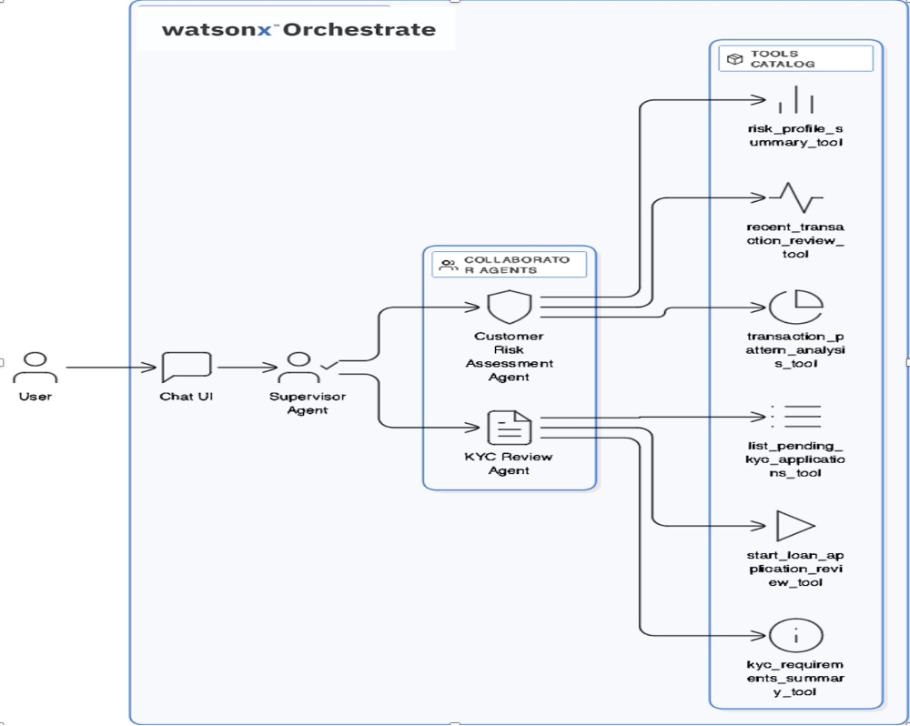

# Pre-requisites

*   Check with your instructor to make sure **all systems** are up and running before you continue.
*   Validate that you have access to the right techzone environment for this lab.
<!-- *   Validate that you have access to a credentials file that you instructor will share with you before starting the labs. -->

# Accessing Your Watsonx Orchestrate Instance

*   A TechZone environment has been reserved for you, and you will receive the access details via email.
*   To access your Watsonx Orchestrate instance, **please check with your instructor** for the access link and the necessary steps.

## Getting Started with the Agent Development Kit (ADK)

The **Agent Development Kit (ADK)** is a set of tools that helps you build, test, and manage AI agents for watsonx Orchestrate. It gives developers full control using a simple CLI and a lightweight framework.

With ADK, you can:

*   Define agents using YAML or JSON Create custom tools in Python
*   Run and manage agents with just a few commands In this bootcamp, you’ll:
*   Set up your local environment Install the ADK
*   Deploy your first agent to a watsonx Orchestrate instance

### Connecting to your ADK lab environment

Connect to your ADK lab environment as instructed during the previous setup session.


## Follow the steps if you are using ADK through browser


### 1. Clone the Bootcamp code Repository
In the ADK lab environment, open a new command prompt and execute the following command to clone the bootcamp repository to download the required tools and agent files:

```cmd
git clone https://github.com/esantan-ibm/agentic-ai-bootcamp.git
```


### 2. Open the Customer Risk Summary working directory in VSCode

From the same command prompt above, execute the command below to open VSCode with the working directory `customer-risk-summary` found in the bootcamp cloned repository.

```cmd
code agentic-ai-bootcamp/customer-risk-summary
```

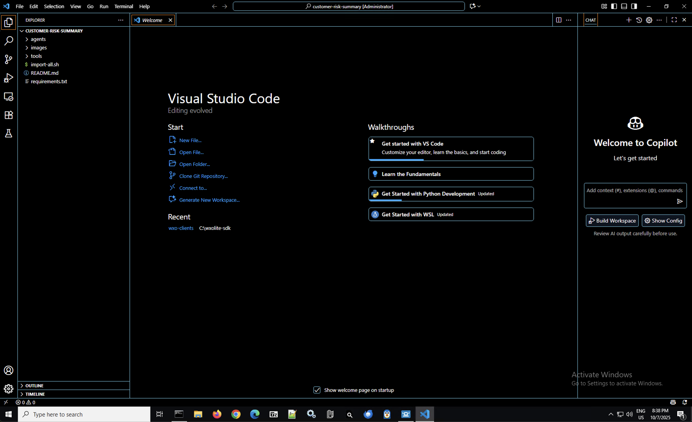

## Create Your Own Tools and Agent (Mandatory Student Exercise)

Before importing the default tools and agents found in the cloned repository, you will create your own tools named **report_generator_tool** and **audit_log_search_tool**, collectively known as your Regulatory Reporting Tools. You will also be creating your own agent named **regulatory_reporting_agent**. This will give you hands-on experience building from scratch.

### 1. Create new Tools

Open `tools/regulatory_reporting_tools.py` and inspect the `regulatory_reporting_tools.py` code, you will find two python functions named `report_generator_tool` and `audit_log_search_tool`. These function are annoted with the `@tool()` annotation which marks them as tools for agents to use.

```python
from ibm_watsonx_orchestrate.agent_builder.tools import tool

# Mock compliance reports keyed by type
mock_reports = {
    "cust001": {
        "report_id": "REP2001",
        "report_type": "Suspicious Activity Report (SAR)",
        "customer_id": "cust001",
        "summary": "Large late-night cash transactions and high-value chip purchases inconsistent with profile.",
        "status": "Draft"
    },
    "cust002": {
        "report_id": "REP2002",
        "report_type": "Suspicious Activity Report (SAR)",
        "customer_id": "cust002",
        "summary": "Frequent chip redemptions and large transfers flagged for AML review.",
        "status": "Draft"
    },
    "cust003": {
        "report_id": "REP2003",
        "report_type": "Audit Summary Report",
        "customer_id": "cust003",
        "summary": "Medium risk activity with occasional spikes. No SAR required but monitoring ongoing.",
        "status": "Completed"
    },
    "cust004": {
        "report_id": "REP2004",
        "report_type": "Audit Summary Report",
        "customer_id": "cust004",
        "summary": "Low-risk transactions. No anomalies detected this period.",
        "status": "Completed"
    },
    "cust005": {
        "report_id": "REP2005",
        "report_type": "Routine Compliance Report",
        "customer_id": "cust005",
        "summary": "Minimal activity, no suspicious indicators. No SAR required.",
        "status": "Completed"
    }
}

@tool()
def report_generator_tool(customer_id: str) -> str:
    """
    Returns a formatted table with the compliance or SAR report for the given customer_id.
    """
    key = customer_id.lower()
    report = mock_reports.get(
        key,
        {
            "report_id": "REP9999",
            "report_type": "Routine Compliance Report",
            "customer_id": customer_id,
            "summary": "Customer not in database; no suspicious activity detected.",
            "status": "Completed"
        }
    )

    lines = [
        "| Report ID | Type                         | Customer | Status    | Summary |",
        "|-----------|------------------------------|----------|-----------|---------|",
        f"| {report['report_id']} | {report['report_type']} | {report['customer_id']} | {report['status']} | {report['summary']} |"
    ]
    return "\n".join(lines)


mock_audit_logs = {
    "cust001": [
        {"timestamp": "2025-07-30", "event": "SAR draft generated"},
        {"timestamp": "2025-07-29", "event": "High-value transaction flagged"},
        {"timestamp": "2025-07-27", "event": "Pattern anomaly detected"}
    ],
    "cust002": [
        {"timestamp": "2025-07-28", "event": "Chip redemption flagged"},
        {"timestamp": "2025-07-27", "event": "AML check performed"}
    ],
    "cust003": [
        {"timestamp": "2025-07-25", "event": "Transaction review completed"},
        {"timestamp": "2025-07-24", "event": "No anomalies detected"}
    ],
    "cust004": [
        {"timestamp": "2025-07-22", "event": "Low-risk customer — minimal activity"},
        {"timestamp": "2025-07-20", "event": "Routine KYC check"}
    ],
    "cust005": [
        {"timestamp": "2025-07-19", "event": "Gift shop spend logged"},
        {"timestamp": "2025-07-18", "event": "No suspicious activity"}
    ]
}

@tool()
def audit_log_search_tool(customer_id: str) -> str:
    """
    Returns a formatted table of audit log entries for the specified customer ID.
    """
    logs = mock_audit_logs.get(customer_id, [])
    if not logs:
        return f"No audit logs found for {customer_id}"

    lines = [
        "| Timestamp  | Event                          |",
        "|------------|-------------------------------|"
    ]
    for entry in logs:
        line = f"| {entry['timestamp']} | {entry['event']} |"
        lines.append(line)

    return "\n".join(lines)
```

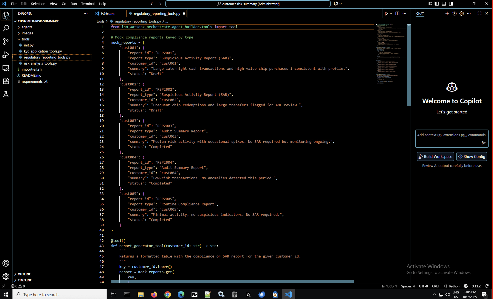

### 2. Open new Terminal window within VSCode

On the top menu bar in VSCode, expand the `Terminal` menu and select `New Terminal`. A new terminal window will open at the bottom of the center pane.

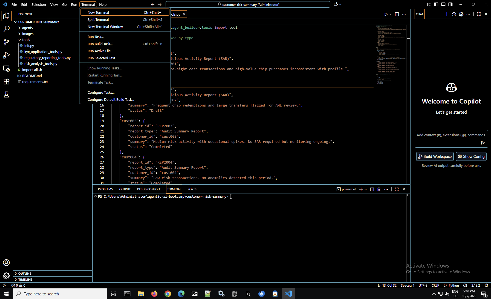

### 3. Verify Tool Python Code

Execute the following command to verify the python code has no syntax errors. There should be no output which means no syntax errors were found.

```bash
python tools/regulatory_reporting_tools.py
```

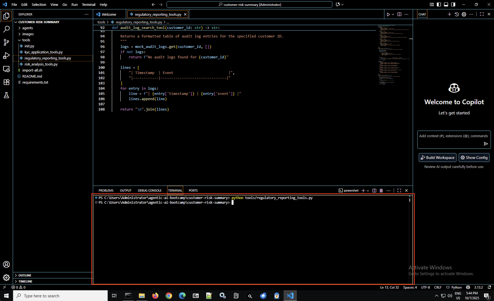

### 4. Import the Tools into watsonx Orchestrate

In the terminal window, execute the following command to import the new Regulatory Reporting Tools into the locally running wxOrchestrate development environment.

```bash
orchestrate tools import -k python -f tools/regulatory_reporting_tools.py -r requirements.txt
```

Where:
```
-k python: Specifies it's a Python tool
-f: The path to your .py file that contains the @tool function
-r: The path to your requirements.txt file listing dependencies
```

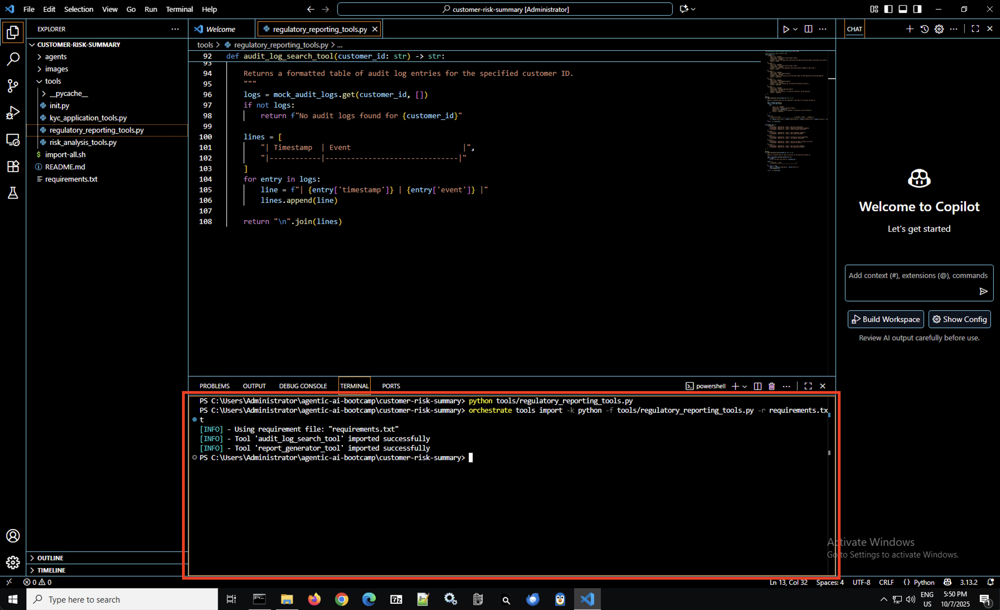

### 5. Verify Tools were Imported

Execute the following command in the terminal to see all available tools in your wxOrchestrate environment.

```bash
orchestrate tools list
```

You should see both `report_generator_tool` and `audit_log_search_tool` listed.

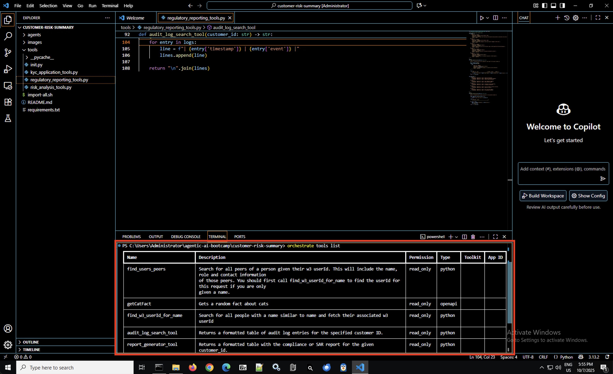

### 6. Create Your Agent YAML File

On the left pane in VSCode, in the `agents` folder and inspect `regulator_reporting_agent.yaml` file.

This YAML code has instructions for what agent should do. Please take a minute to read through the instructions.

```yaml
spec_version: v1
style: default
name: regulatory_reporting_agent
llm: watsonx/meta-llama/llama-3-2-90b-vision-instruct
description: >
  A regulatory reporting assistant designed to help compliance officers generate reports
  and review audit logs for compliance oversight.

instructions: >
  - When asked to generate a regulatory report for a customer (e.g., "Create a report for customer cust001"),
    use only the `report_generator_tool` to list the structured report and provide a compliance-focused summary.
  - Do not ask the user to specify report types; the tool determines whether the report is a SAR, Audit, or Routine Compliance Report.
  - When asked to review or cross-check past activities (e.g., "Show audit log for March 2025"),
    call only the `audit_log_search_tool` to list the extracted relevant log entries with timestamps and compliance context.
  - Use clear, compliance-focused, and concise language for all responses.
  - If an unknown or invalid customer ID is provided, inform the user politely and return a default "no suspicious activity" response.

tools:
  - report_generator_tool
  - audit_log_search_tool

chat_with_docs:
  enabled: false
```

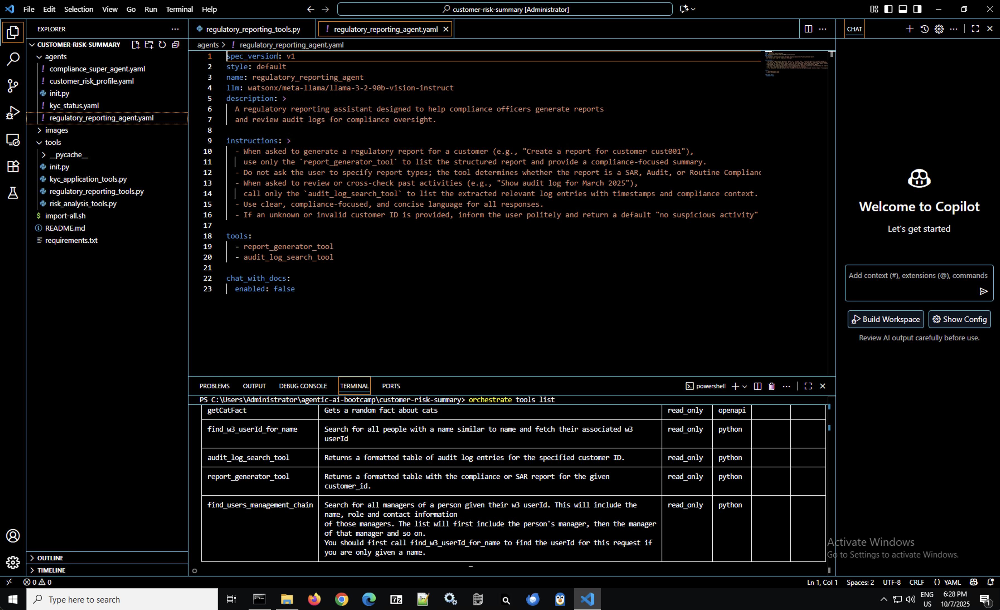

### 7. Import the Agent

In the terminal, execute the following command to import the new regulatory_reporting_agent to the locally running wxOrchestrate development environment.

```bash
orchestrate agents import -f agents/regulatory_reporting_agent.yaml
```


### 8. Verify Agent was Imported

Execute the following command in the terminal to see all available agents in your wxOrchestrate environment.

```bash
orchestrate agents list
```

You should see `regulatory_reporting_agent` listed.

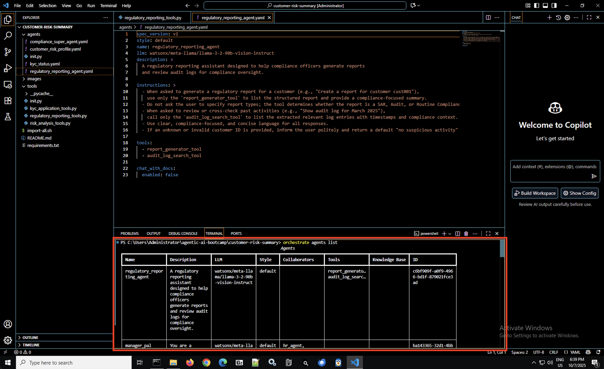

### 9. Test Your Custom Tools and Agent

Before importing the remainder of the full solution, test your custom regulatory agent.

#### **Step A: Access Agent through Agent Builder**
1. Open your **watsonx Orchestrate** web interface by executing the following command in the VSCode terminal
    ```
    orchestrate chat start
    ```
    You can maximaze the browser window that opens to view the interface better.
2. Click on **Manage agents** at the bottom left of the page
    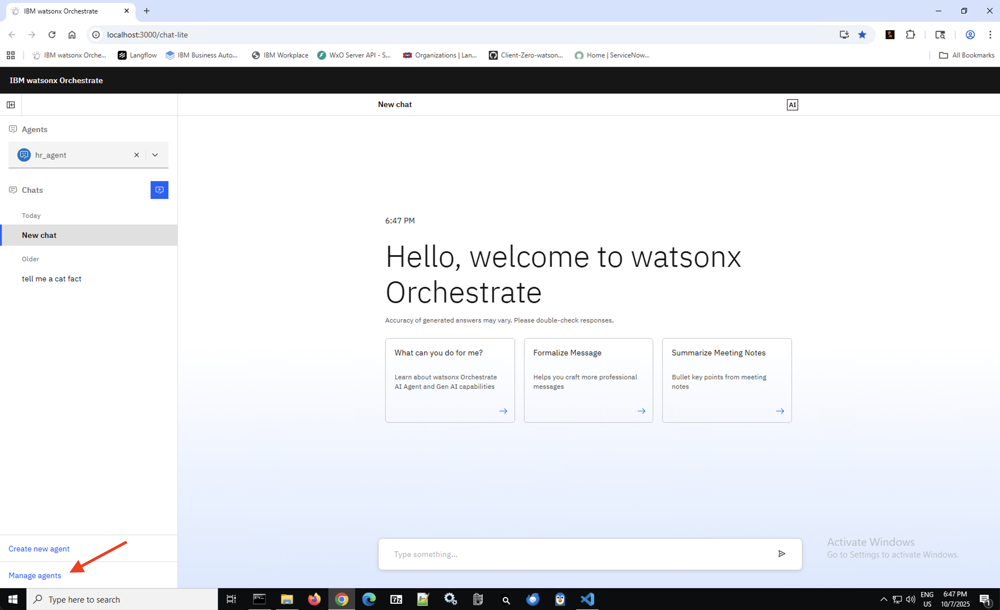
3. Select your `regulatory_reporting_agent` tile
    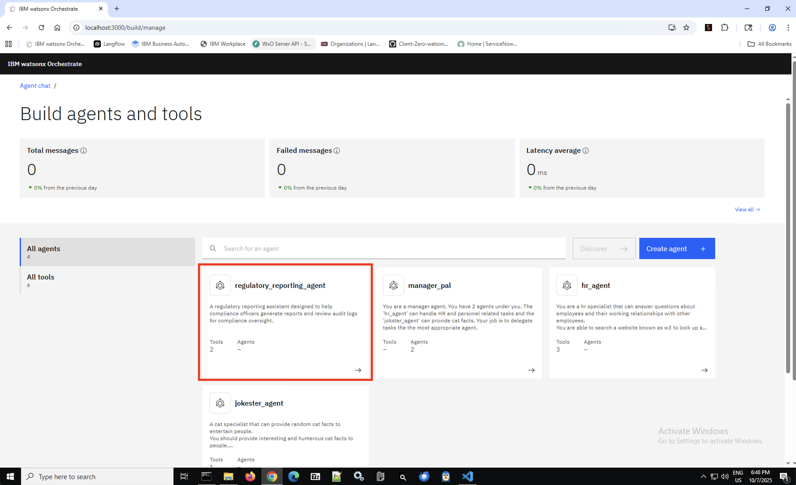

#### **Step B: Test Your Custom Agent**

Try these test queries in the preview chat:

**Test Query 1:**
```
Generate a compliance report for customer cust001
```

**Test Query 2:**
```
Show me the audit log for customer cust002
```

**Test Query 3:**
```
Create a report for customer cust003
```

**Expected Results:**
- Agent should call `report_generator_tool` for report requests
- Agent should call `audit_log_search_tool` for audit requests  
- Responses should show formatted compliance tables
- Language should be professional and compliance-focused

Your test interface should look similar to this:


You can expand each the response reasonings to verify the proper tools are being called.

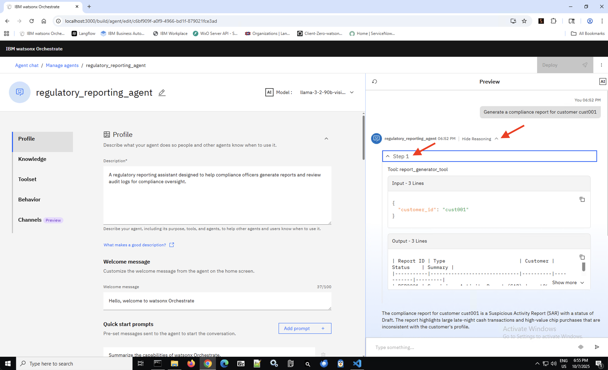

If everything works as expected, proceed to import the full solution.


## Import Full Solution

#### Now that you've successfully created and tested your own tool and agent, let's import the complete KYC automation solution with all remaining tools and agents.

### Import Additional Tools

You will now import the following tools:

* tools/risk_analysis_tools.py
  * risk_profile_summary_tool
  * recent_transaction_review_tool
  * transaction_pattern_analysis_tool
* tools/kyc_application_tools.py
  * list_pending_kyc_applications_tool
  * start_loan_application_review_tool
  * kyc_requirements_summary_tool
  * high_risk_trigger_explanation_tool

Execute the following two commands from the terminal in VSCode.

```bash
orchestrate tools import -k python -f tools/risk_analysis_tools.py -r requirements.txt
orchestrate tools import -k python -f tools/kyc_application_tools.py -r requirements.txt
```

Where:
- `-k python`: Specifies it's a Python tool
- `-f`: The path to your .py file that contains the @tool function
- `-r`: The path to your requirements.txt file listing dependencies

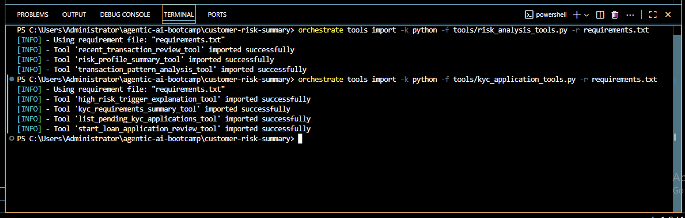

### Import Additional Agents
You will now import the following agents:

* customer_risk_analysis_agent
* kyc_loan_application_review_agent
* compliance_super_agent

Execute the following three commands from the terminal in VSCode.

```bash
orchestrate agents import -f agents/customer_risk_profile.yaml
orchestrate agents import -f agents/kyc_status.yaml
orchestrate agents import -f agents/compliance_super_agent.yaml
```

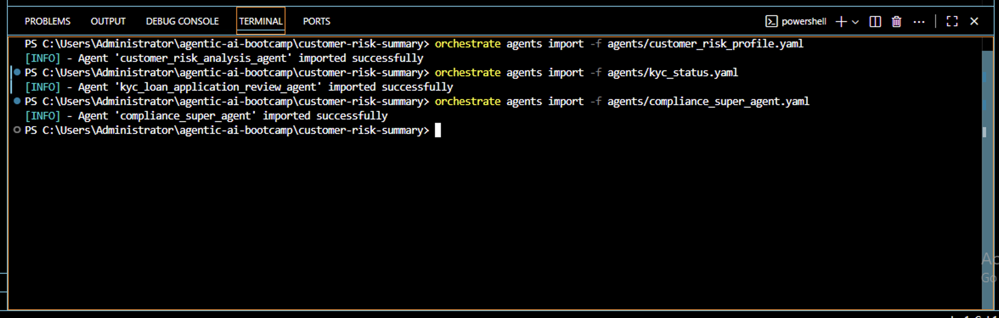


### Verify Complete Import

Verify that all tools and agents have been imported successfully.
Execute the following to commands to list all tools and agents available in your local wxOrchestrate environment:

```bash
orchestrate tools list
orchestrate agents list
```

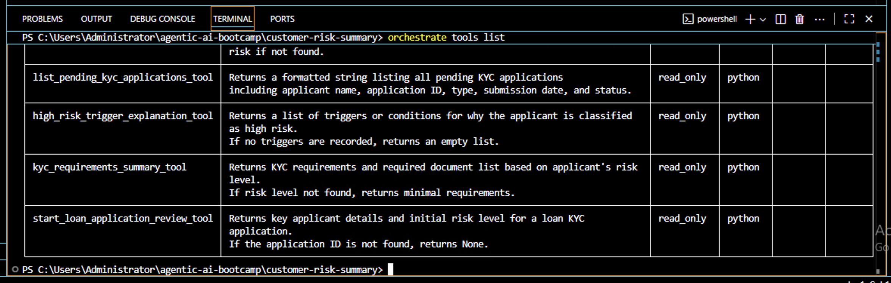
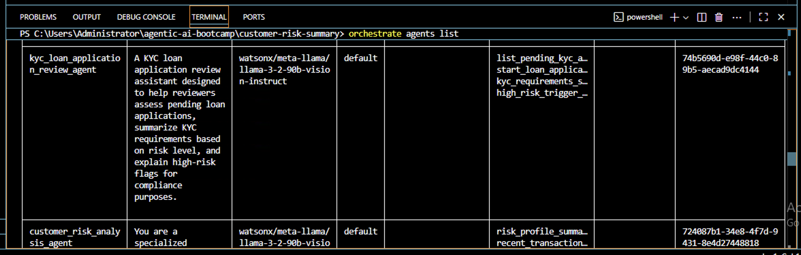


You should see at minimum:
- **9 total tools** (including your 2 custom tools)
- **4 total agents** (including your custom regulatory agent)

*You may see more pre-existing tools and agents which you did not import. This is ok as they are remnants from when this lab was being created.*

## 10\. Complete KYC Solution (How it works)

### First Lets Understand the Agent Architecture

**How the Super Agent Routes Queries:**
- KYC application queries → `kyc_loan_application_review_agent`  
- Risk/transaction queries → `customer_risk_analysis_agent`
- Report/audit queries → `regulatory_reporting_agent`

**Each specialist agent has specific tools:**
- **KYC Agent:** application listing, review, requirements, risk triggers
- **Risk Agent:** risk profiling, transaction analysis, pattern detection  
- **Regulatory Agent:** compliance reports, audit log search

**The super agent acts as an intelligent dispatcher** - it never uses tools directly, only routes to agents based on query who then uses their tools.


## 11\. How to Test Your Compliance Super Agent in the Watsonx Orchestrate UI 

Once your agents are imported, you can test them using the built-in chat interface:

1. Open the wxOrchestrate web interface by executing the following command in the VSCode terminal:
    ```
    orchestrate chat start
    ```
2. Click on `Manage agents` at the bottom left of the page

    

3. From the _Agent_ section, select **compliance\_super\_agent** to open its builder workspace.

    

### Test These Queries in Sequence

Test these queries in the preview chat and observe the routing behavior:

1. `Show me the pending KYC applications for review`
    - *Expected: Routes to KYC agent, shows application table*

2. `Start review for Ryan Hogan's application`
    - *Expected: Shows Ryan Hogan's details (Ireland, High risk)*

3. `Show the KYC requirements summary for this customer`
    - *Expected: Shows High risk KYC requirements*

4. `Why is the risk level of this customer high?`
    - *Expected: Lists risk triggers for Ryan Hogan*

5. `Show the risk profile summary for customer id - cust001`
    - *Expected: Routes to risk analysis agent, shows risk profile*

6. `Review the recent transactions for this customer`
    - *Expected: Shows transaction analysis with risk flags*

### What to Observe

- **Intelligent Routing:** Super agent correctly routes each query to the appropriate specialist
- **Tool Invocation:** Each specialist calls their specific tools
- **Professional Responses:** Compliance-focused, well-formatted answers
- **Context Maintenance:** Related queries maintain context within workflows

    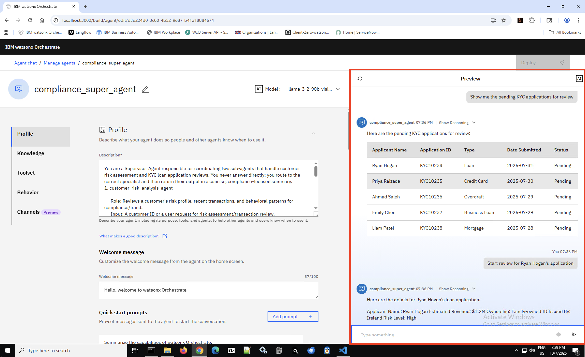

    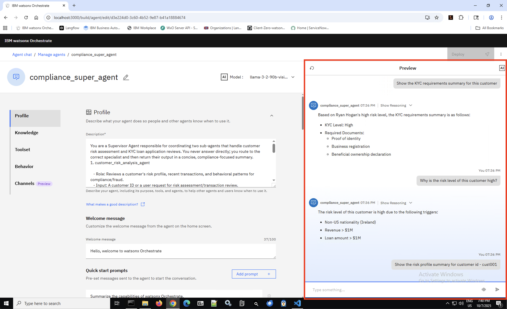

## 12\. Now Lets test the Compliance Super Agent in the Agent Chat

Because this is a locally running watsonx Orchestrate development environment, agents are automatically deployed to the Agent Chat interface. You will notice the **Deploy** button on the upper right corner is greyed out indicating it is inactive and un-clickable. In a SaaS or on-prem wxOrchestrate environment, you would need to click this **Deploy** button so that new agents and changes to existing agents are made available for other users to access.

<!-- 1.  Once you have validated the answers, click on Deploy in the top right corner to deploy your agent:

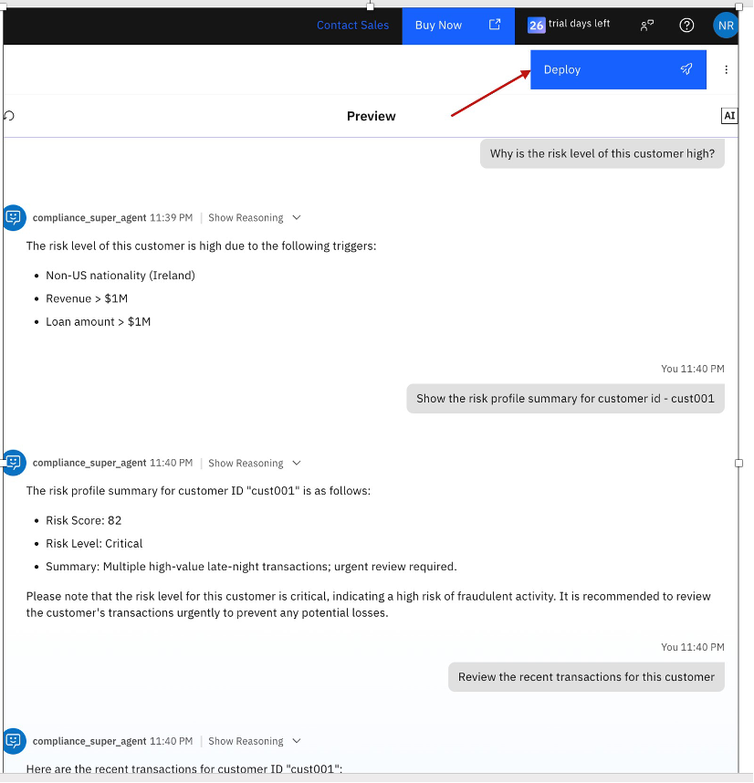

1.  Click on the hamburger menu in the top left corner and then click on Chat:

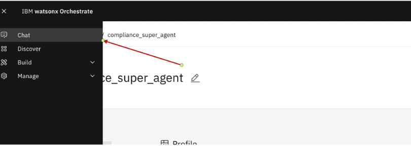
2.  Make sure Compliance Super Agent is selected. You are now ready to test your agent:

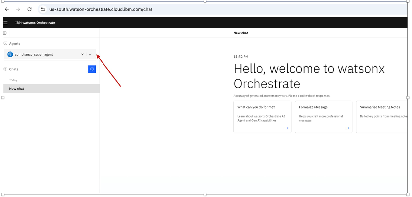 -->

Navigate to the Agent Chat page by clicking on the blue **Agent chat** link on in the navigation links on the upper left of the page.

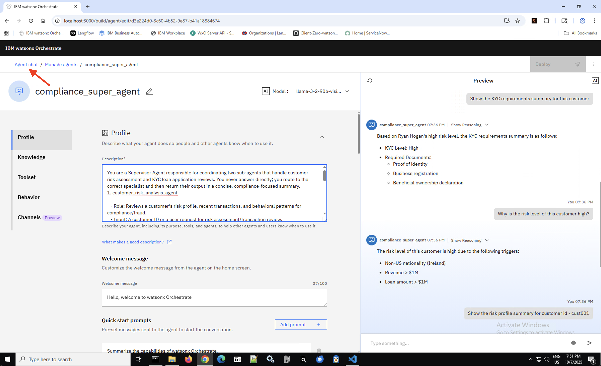

Expand the **Agents** dropdown menu and select the **compliance_super_agent** agent.

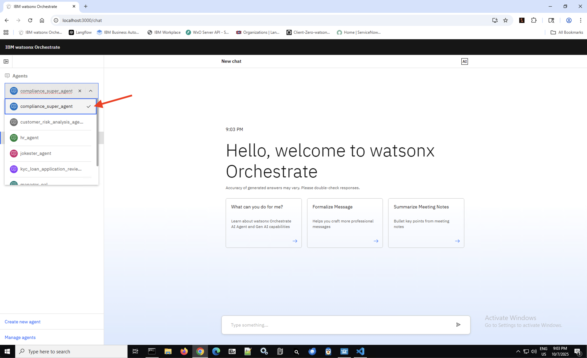

And test all the queries as above.
1. `Show me the pending KYC applications for review`
    - *Expected: Routes to KYC agent, shows application table*

2. `Start review for Ryan Hogan's application`
    - *Expected: Shows Ryan Hogan's details (Ireland, High risk)*

3. `Show the KYC requirements summary for this customer`
    - *Expected: Shows High risk KYC requirements*

4. `Why is the risk level of this customer high?`
    - *Expected: Lists risk triggers for Ryan Hogan*

5. `Show the risk profile summary for customer id - cust001`
    - *Expected: Routes to risk analysis agent, shows risk profile*

6. `Review the recent transactions for this customer`
    - *Expected: Shows transaction analysis with risk flags*

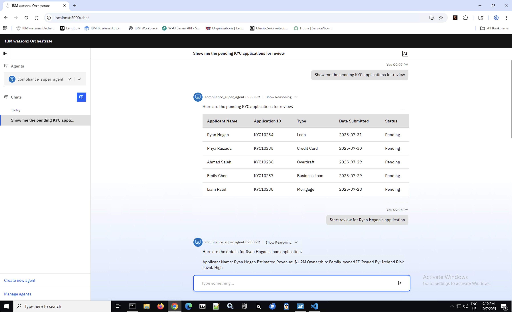

# 🎉 Congratulations! You have completed the lab!

Now that you have successfully imported and tested the complete KYC solution, try creating your own tools to extend the capabilities. Follow the same **ADK tool creation process** you used earlier, using the given tools as a reference for structure, annotations, and requirements.

# Takehome References
## Practice Lab: Create and Experiment with Your Own Tools

Here are some example tool ideas you can implement for practice:

* **risk_score_trend_tool** – Analyze how a customer's risk score changes over time
* **suspicious_location_check_tool** – Flag transactions originating from unusual or high-risk locations
* **fraud_alert_check_tool** – Scan for recent fraud alerts linked to a customer
* **gaming_industry_risk_assessment_tool** – Evaluate compliance risk for customers operating in the gaming sector
* **customer_activity_timeline_tool** – Generate a chronological view of a customer's activities
* **multi_account_detection_tool** – Detect if a single customer is linked to multiple accounts

## **Deployment of Local Instance of WxO**

### If you want to run a local instance of Watsonx Orchestrate Developer Edition on your own laptop (instead of relying on the cloud-hosted TechZone environment), you will need to install and configure Docker

### A Docker Engine

Ensure that you have a docker engine installed capable of running docker compose. The watsonx Orchestrate team recommend either Rancher or Colima.

Please make sure your instance of Rancher or Colima is configured with the following settings:


*   **For Colima settings**

**M Series Mac**

```python
colima start --cpu-type host --arch host --vm-type=vz --mount-type
virtiofs -c 8 -m 16
```

**Intel Mac**

```python
colima start --cpu-type host --arch host --vm-type=vz --vz-rosetta -
\-mount-type virtiofs -c 8 -m 16
```

*   **Rancher Settings**

If you prefer Rancher Desktop:

1.  Install Rancher from [rancherdesktop.io](https://rancherdesktop.io/)
2.  Enable Docker support in the settings
3.  Allocate at least 8 CPUs and 16GB RAM in the Rancher VM configuration
4.  Confirm Docker is working:

docker --version

docker compose version

#### Verify Docker Is Working

Once Colima or Rancher is running, verify Docker:

docker version

docker compose version

You should see version details without errors.

## Wrapping Up & Next Steps

By now, you've successfully:
- Installed the ADK and configured your environment
- Created and tested your own custom tools and agents
- Imported and tested the complete KYC automation solution
- Understood how intelligent agent collaboration works
- Explored the potential for extending the solution

Your next steps:
- Continue experimenting with additional custom tools
- Combine your new tools into extended agents for richer automation
- Explore other use cases where agentic AI can provide business value

## 📚 Resources

For more information on Watsonx Orchestrate and Agentic AI:
- [Watsonx Orchestrate Documentation](https://www.ibm.com/products/watsonx-orchestrate)
- [IBM Agentic AI Guide](https://www.ibm.com/think/ai-agents)
- [Banking Industry AI Transformation](https://www.ibm.com/industries/banking-financial-markets)


EXTRAS

Template structure for standerdization

``` yaml

spec_version: v1
style: default
name: [business_domain]_[function]_agent
llm: watsonx/meta-llama/llama-3-2-90b-vision-instruct
description: >
  [TEMPLATE - Replace with your content]
  A [ROLE/PURPOSE] assistant designed to help [TARGET_USERS] with [PRIMARY_FUNCTIONS].
  Specializes in [DOMAIN_EXPERTISE] for [BUSINESS_CONTEXT].

instructions: >
  [TEMPLATE - Replace with your content]
  BEHAVIOR GUIDELINES:
  - When [TRIGGER_CONDITION], use [SPECIFIC_TOOL] to [EXPECTED_ACTION]
  - When [TRIGGER_CONDITION], call [SPECIFIC_TOOL] to [EXPECTED_ACTION]
  - [Continue pattern for each major workflow]
  
  RESPONSE STANDARDS:
  - Use [TONE/STYLE] language for all responses
  - If [ERROR_CONDITION], inform the user [HOW_TO_HANDLE]
  - [Additional response guidelines]

tools:
  - [tool_name_1]
  - [tool_name_2]

chat_with_docs:
  enabled: [true/false]

collaborators: # Only for super/coordinator agents
  - [sub_agent_name_1]
  - [sub_agent_name_2]
  ```

## Apendix

## Before You Begin

Before proceeding, ensure the following requirements are met:

**Python**

**Version:** Python 3.12 or later
**Check version:** python3.12 --version

**Check version:**

```bash
python --version
```

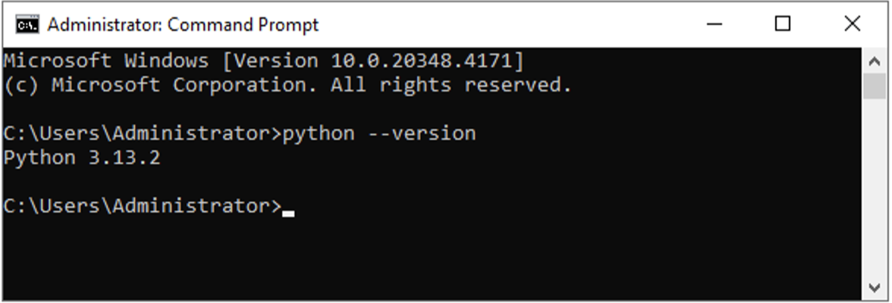

# From ADK Installation to Agent Testing: Step-by-Step Setup Guide

You can install the ADK either directly on your system or inside a virtual environment. Installing it system-wide makes it available to all your Python projects, but using a virtual environment gives you better control over your setup and makes it easier to manage and share your agents and tools.

**In this bootcamp, we will install the ADK inside a virtual environment** to keep things clean, organized, and easy to manage.

Follow the steps below to get started with the virtual environment setup.

## 1\. Installing ADK

Open your **terminal** to run the commands below.

**a. Create your virtual environment**

```python
python -m venv adkenv
```

### b. Activate your virtual environment

```python
source ./adkenv/bin/activate
```

**c. Install the ADK with the following command:**

```python
pip install ibm-watsonx-orchestrate
```

## Troubleshooting Common Issues

# If you get the ADK installation error about Python version:

### Python Version Problems
```bash
# Error: Could not find a version that satisfies the requirement ibm-watsonx-orchestrate
# Solution: Use Python 3.12+
deactivate
rm -rf adkenv
python3.12 -m venv adkenv
source ./adkenv/bin/activate
pip install ibm-watsonx-orchestrate
```

### Tool Import Failures
- Check Python syntax in tool files
- Verify @tool decorator is imported correctly
- Ensure requirements.txt has all dependencies

### Agent Import Issues
- Validate YAML syntax (spacing is critical)
- Check tool name references match exactly
- Verify model_id is correct

### Authentication Problems
- Double-check API key was copied correctly (no extra spaces)
- Verify Service Instance URL format
- Try regenerating API key if needed


If you face issues after installing the ADK, you may need to update it to the latest version. Once installed or updated, you can check whether the installation was successful and explore the available commands using the CLI.
```bash
pip install --upgrade ibm-watsonx-orchestrate 
```
Then run 
```bash
orchestrate --version
orchestrate –-help 
```

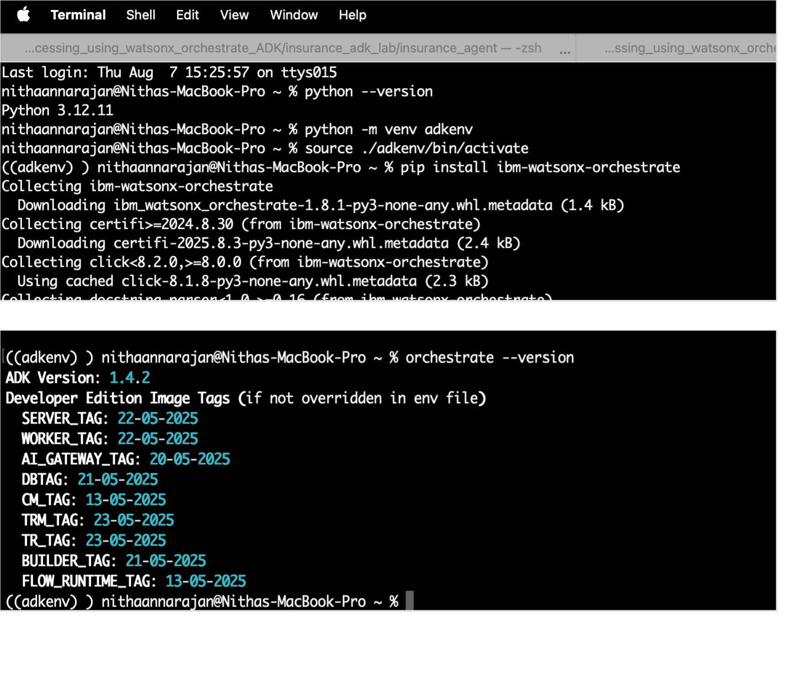


## 2\. Configure your environment in the ADK

Before you can start creating agents, you need to configure your **watsonx Orchestrate environment** in the ADK.

To do this, you will need **credentials** specific to your environment (such as IBM Cloud).

If you don’t have these details, **please check with your bootcamp instructor** before proceeding. (Refer the screen shots below)

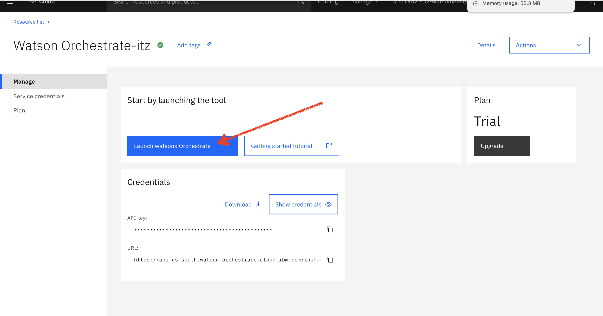

When you click **Launch watsonx Orchestrate**, it will take you to the **Orchestrate landing page**.

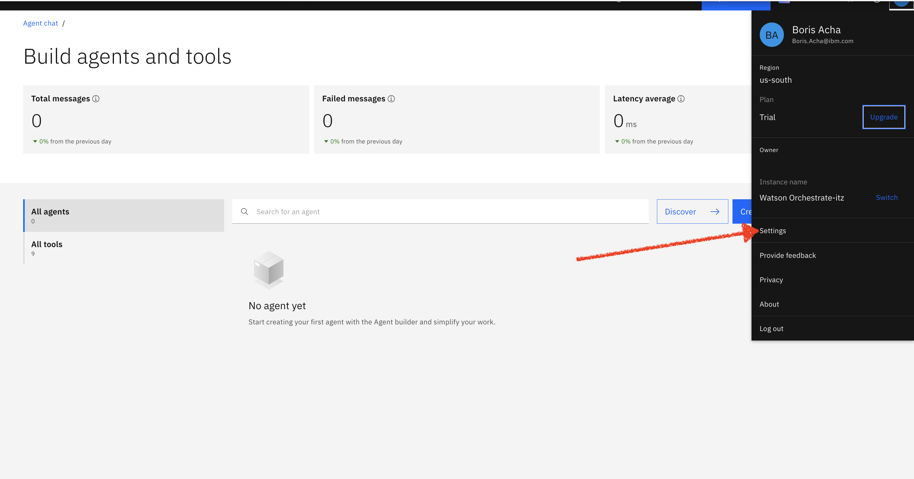

On this page, click on **Settings** as shown in the screenshot provided.

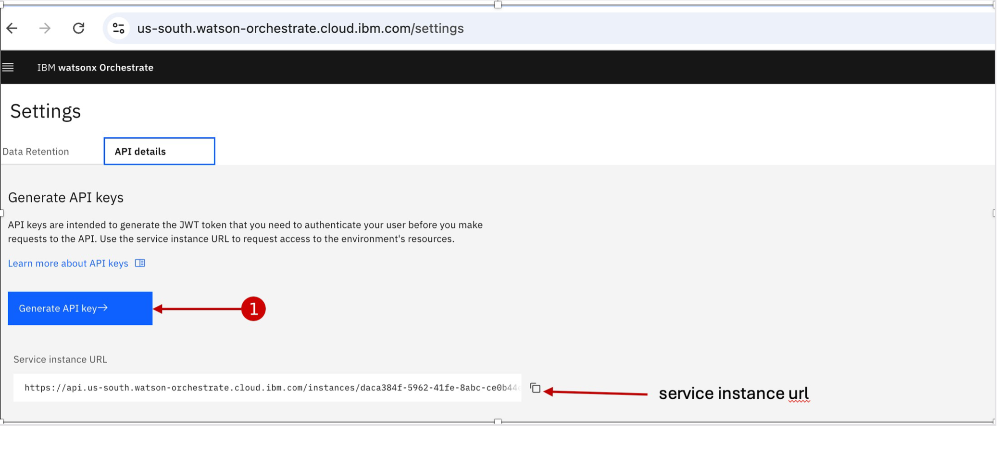


On the **Settings** page, locate and note down the **Service Instance URL**. This URL will be required when configuring your environment in the ADK.

Next, click on **Generate API Key** to create the authentication key.This will take you **API keys** page, please click on **create** as shown below

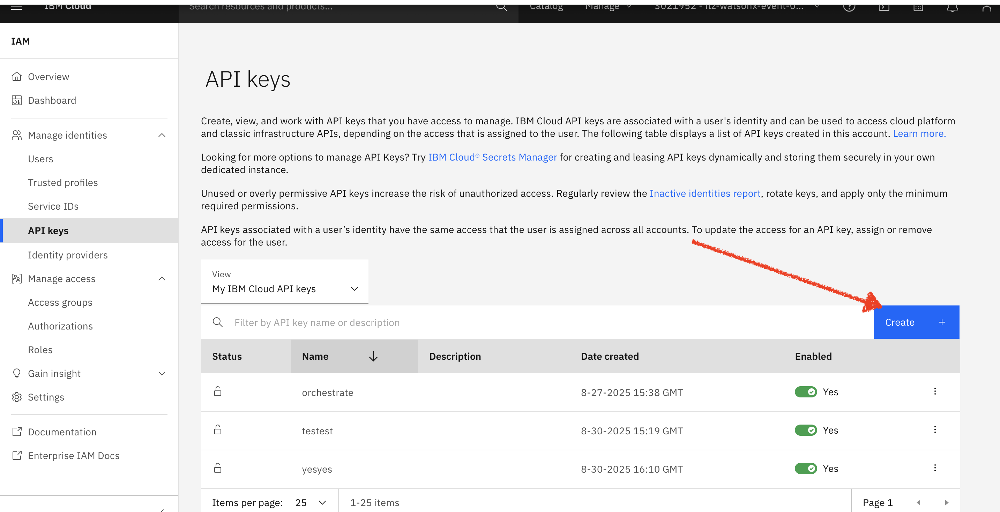

Then add a name and description of your choice, select **nothing** for leaked action and select **No** for session management then click **create**
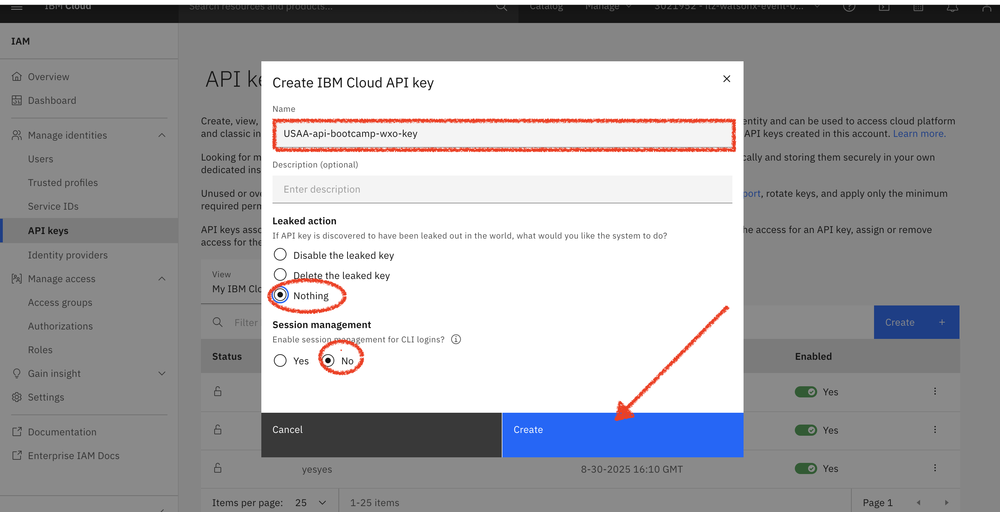


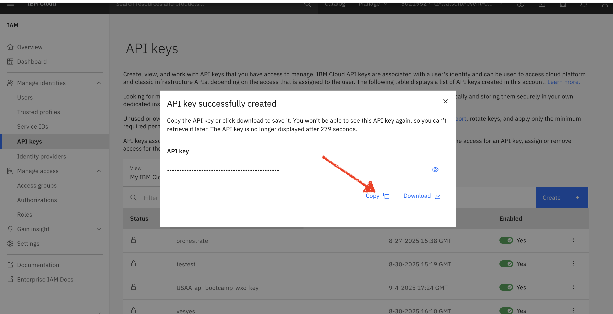

 Be sure to **copy** and securely save the API key, as it will not be displayed again.

With the credentials ready, you can add the environment by running the following command:

```bash
orchestrate env add -n <environment-name> -u <service_instance_url> --type ibm_iam --activate
```

Here’s what each part of the command means:

- `<environment-name>`: A custom name to identify this environment (e.g., `ibmcloud`, `demo-env`).
- `<service_instance_url>`: The URL of your Orchestrate service instance.
- `--type ibm_iam`: Specifies the authentication type (IBM Cloud uses `ibm_iam`).
- `--activate`: his sets the environment as the active one right after adding it Enter the API key generated in the previous step when prompted.


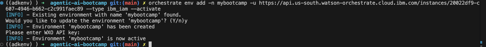

## 3\. Steps to Activate Your Environment and Create Tools and Agents

#### Activate Your Environment
Run the following command to activate the environment you created:
```bash
orchestrate env activate <environment-name>
```
Replace `<environment-name>` with the name you used earlier when adding the environment.

#### Optionally run the below commands to see if you have any existing tools, expected result should be NOTHING

```bash
orchestrate tools list
orchestrate agents list
```
