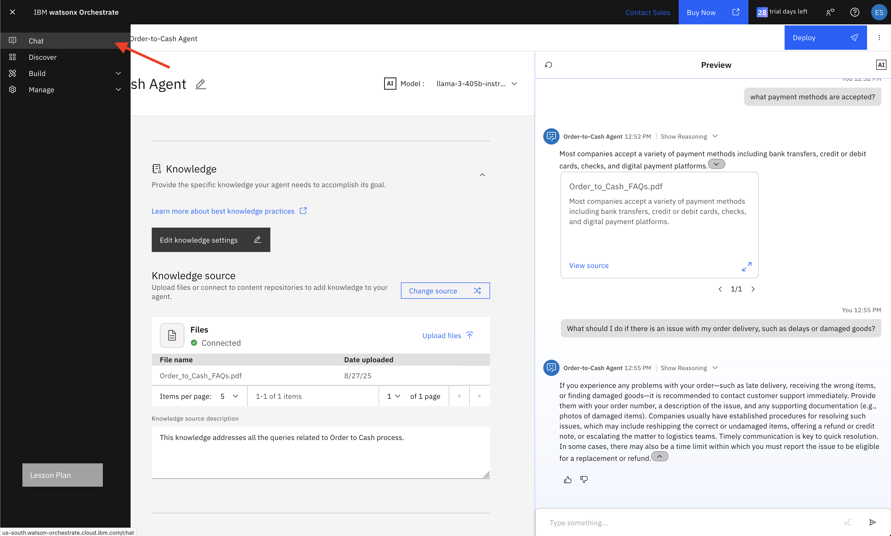
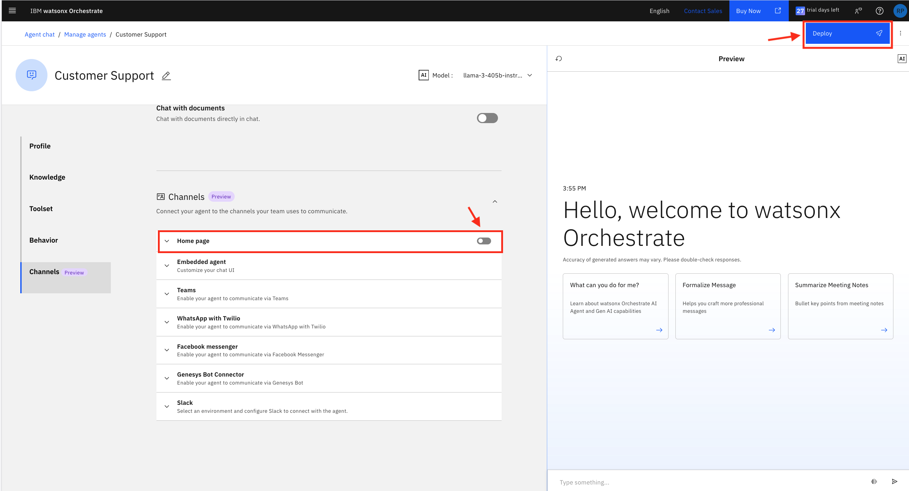

# 👨🏻‍💻 Use case: Order to Cash  

## Table of Contents
- [Use Case Description](#use-case-description)
- [Architecture](#architecture)
- [Pre-requisites](#pre-requisites)
- [watsonx Orchestrate](#watsonx-orchestrate)
  - [Accessing watsonx Orchestrate](#accessing-watsonx-orchestrate)
- [Order-to-Cash Agent Creation](#order-to-cash-agent-creation)
  - [Agent Configuration with Knowledge Base](#agent-configuration-with-knowledge-base)
- [Customer Support Agent Creation and Configuration](#customer-support-agent-creation-and-configuration)
- [Order Management Agent Creation and Configuration](#order-management-agent-creation-and-configuration)
- [Pulling it together - Complete Agent Collaboration](#pulling-it-together)
- [Experience Agents in Action using watsonx Orchestrate Chat UI](#experience-agents-in-action-using-watsonx-orchestrate-chat-ui)
- [Conclusion](#conclusion)

## Use Case Description

This use case focuses on transforming the end-to-end Order-to-Cash (O2C) process using IBM watsonx Orchestrate, as illustrated in the architecture diagram. The solution aims to automate key stages of the O2C cycle—from order placement, invoicing, enhance customer satisfaction, accelerate cash flow, and deliver measurable impact to the bottom line by integrating intelligent agents and enterprise systems.

In this lab, we will build an O2C agent in watsonx Orchestrate that simulates interactions with core business functions such as customer support and order management. The agent will streamline order management, reduce manual effort, accelerate invoice processing, and drive faster cash conversion, ultimately improving operational efficiency and customer satisfaction.


## 🏛 Architecture  <a id="architecture"></a>


## Pre-requisites
To run the steps in this hands-on lab portion of the bootcamp, you need access to **watsonx Orchestrate** and **watsonx.ai** which are provided for you as part of the preparation for this bootcamp.

- Please go the through the [environment-setup](https://github.ibm.com/skol/agentic-ai-client-bootcamp/tree/release/v3.0.0/environment-setup) guide for steps on API key creation, and project setup.

- Check with your instructor to make sure **all systems** are up and running before you continue.


## watsonx Orchestrate
As detailed in the [Solution Architecture](./images/o2c-arch-sb.png), we will build and deploy the majority of the agents for the solution in watsonx Orchestrate. AI Agents are autonomous entities that can run tasks, decide and interact with their environment. In IBM watsonx Orchestrate, agents are a key component of our agentic AI framework, enabling the creation of complex, dynamic systems that can adapt and respond to changing conditions. 

### Accessing watsonx Orchestrate
To access watsonx Orchestrate, follow these steps:

1. If not already logged into your IBM Cloud account, navigate your preferred browser to https://cloud.ibm.com and log in with your IBM credentials.

2. On your IBM Cloud landing page, make sure you are accessing IBM Cloud account which has been provided to you for this lab.


3. At the top left, expand the navigation menu (hamburger menu) and select **Resource list**.
 

4. On the Resource List page, expand the **AI / Machine Learning** section, and click the **Watsonx Orchestrate** service service name.
 

5. Click **Launch watsonx Orchestrate** to launch the service.
 

6. Once the watsonx Orchestrate service is launched, you will be at its landing page as illustrated in the screenshot below. You will see an intuitive conversational interface with a chat field where you can type any text to start interacting with watsonx Orchestrate.

    When you start with a new service instance, there will be no custom agents defined and thus, the section under **Agents** will state *No agents available*.

    To start developing new agents, you can either click **Create or Deploy** an agent under the Agents section or you can click **Create new agent** at the bottom left of the page.

    You can also click the **Manage agents** link to navigate to the agent management page.

    Try to type a few generic questions and observe the responses from the large language model (LLM) powering the prebuilt agent in watsonx Orchestrate which ensures basic functionality until custom agents are created.
    

## Order-to-Cash Agent Creation
In this section, you will go through the process of creating an AI agent in watsonx Orchestrate:

7. To start building agents, you can click the **Create new agent** link as referenced in step 6 above or alternatively, open the top left navigation menu, expand the **Build** section and select **Agent Builder**. This will redirect you to the Manage agents page.
 

8. The Manage agents page will initially be blank since no agents have been created yet. As you create more and more AI agents that can reason and act, the Manage agents page will be populated with those agents. Click **Create agent** button to start building your first agent.
 

9. On the Create an agent page, select the  **Create from scratch** tile, provide the following values for **Name** and **Description** for the agent and click **Create**.

    Name: ```Order-to-Cash Agent```

    Description:
    ```
    This Supervisor Agent orchestrates and manages the flow of conversation by intelligently routing user queries to the appropriate specialized agents based on the context.
    Supervisor Agent oversees two domain-specific agents:
    1. Order Management Agent
    2. Customer Support Agent
    It also handles general queries by routing them to a knowledge base.
    ```
    Watsonx Orchestrate supports creating an agent from scratch or from a template which involves browsing a catalog of existing agents and using attributed of another agent as a template for the new agent. For this lab, you will be creating agents from scratch.
     

### Agent Configuration 
After the AI Agent is created, you will go through the process of configuring the agent with knowledge and tools to enable it to respond to queries using information from its knowledge base and perform tasks using the tools.

10. The first step to configuring the Agent is to select the Large Language Model (LLM) to use. At the top center, expand the Model dropdown and select **llama-3-405b-instruct**. This is the LLM the Agent will use for reasoning and responses. Each agent in your environment can use a different LLM.


11. The Order-to-Cash Agent page is split in two halves. The right half is a **Preview** chat interface that allows you to test the behavior of your agent. The left half of the page consits of four key sections that you can use to configure your agent.

    - Profile: The **Profile** section consists of the description of the agent which you provided as part of creating the agent. You can always go to this section to edit and refine the description of the agent as needed.

    - Knowledge: The **Knowledge** section is where you can add knowledge to the agent. Adding knowledge to agents plays a crucial role in enhancing their conversational capabilities by providing them with the necessary information to generate accurate and contextually relevant responses for specific use cases. You can directly upload files to the agent, or connect to a Milvus or Elasticsearch instance as a content repository. Through this **Knowledge** interface, you can enable your AI agents to implement the Retrieval Augmented Generation (RAG) pattern which is a very popular AI pattern for grounding responses to a trusted source of data such as your enterprise knowledge base.

    - Toolset: While *Knowledge* is how you empower agents with a trusted knowledge base, **Toolset** is how you enable agents to take action by providing them with *Tools* and *Agents*. Agents can accomplish tasks by using **Tools** or can delegate tasks to other **Agents** which are deeply skilled in such tasks.

    - Behavior: The **Behavior** section of the agent configuration is where you provide instructions to the agent to define how it responds to user requests and situations. You can configure rules that dictate when and how the agent should take action. These rules help the agent behave in a predictable and consistent manner, delivering a seamless user experience.

    - Channels: The **Channels** section is where you can connect your agent to the channels your team uses to communicate (under preview). You can enable your agent to communicate via teams, WhatsApp with Twilio, Facebook messenger, Genesys Bot Connector.

    Lastly, after you've completed your agent configuration and tested its performance, you can **Deploy** the agent to make it available through the selected channel. At this time, the main channel supported is the *Chat* home page you access when you first launched watsonx Orchestrate. The product will be adding support for additional channels where you can deploy your agent(s).
     

12. On the agent configuration page, review the *Description* of the agent in the **Profile** section and keep as is (no edits necessary).

13. Scorll down to the **Knowledge** section, or click the **Knowledge** shortcut and click the *Choose knowledge* button under Knowledge source.


14. For the knowledge source, you will be uploading a PDF. Select **Upload files** from the available sources and then click *Next*.


15. Drag and drop [Order_to_Cash_FAQs.pdf](./Order_to_Cash_FAQs.pdf) and then click *Next*.


16. Now you will provide a description to the Agent of the knowledge base contents that was uploaded. Provide the following description and click *Save*.

    Description:
    ```
    This knowledge addresses all the queries related to Order to Cash process.
    ```
    

17. It can take a minute or longer for the knowledge base to be created. Once the knowledge base is ready, you should see a *Knowledge is ready* message as well as see the files in the **Knowledge** section.


18. With the knowledge base ready, you can now test the Agent and validate its responses. Try the two questions below:
    ```
    What payment methods are accepted?
    ```
    ```
    What should I do if there is an issue with my order delivery, such as delays or damaged goods?
    ```
    You should see answers to being retrieved from the uploaded documents and the final response generated by the agent as illustrated in the figure below. Expand the sources dropdown at the end of each response to see which documents the Agent retrieved the answer from. You can further click *View source* to see a larger chunk of text from the document the answer originated from.
     

At this time, it is worthwhile taking a moment to reflect on what you've developed so far. You have design an agent and empowered it with a knowledge base to enable it to respond to queries in context using its knowledge base. *Congratulations!!*

19. To make the agent available for use by your team, click the *Deploy* button at the top right. Then click the *Deploy* button at the bottom right of the Deploy Agent popup.


## Customer Support Agent Creation and Configuration
In this section, you will create the Customer Support Agent, a collaborator agent designed to handle customer queries by retrieving relevant email threads and providing real-time order updates. This agent is powered by a combination of tools including the **Email Retrieval Tool** for accessing customer messages and the **Order Lookup Tool** for fetching order status. The agent mirrors real-world support workflows by curating responses and optionally sending emails to customers, all within a guided conversational flow.

20. Go back to the watsonx Orchestrate landing page by opening the navigation menu at the top left and clicking on *Chat*.


21. From the watsonx Orchestrate langding page, click **Create new agent** at the bottom left to start developing the new Customer Support Agent. 
 

22. On the Create an agent page, select the **Create from scratch** tile , provide the following **Name** and **Description** for the agent and click **Create**.

    Name: ```Customer Support```

    Description: 
    ```
    This agent is helpful for all the customer support queries. This agent fetches all user email addresses, retrieves order updates on user input (order id) from the tool, and sends a relevant email to the user with their respective order update.
    ```

    As explained earlier, the decription of an agent is important as it is leveraged by the agentic solution to route user messages to the right agent skilled in addressing the request.
     

23. The first step to configuring the agent is to select the LLM Model. Select from **llama-3-405b-instruct** from the model dropdown.


24. On the agent configuration page, scroll down to the **Toolset** section or click the shortcut. Then cick the **Add tool** button to bring up the window for adding tools to the agent.
 

25. watsonx Orchestrate supports multiple approaches to adding tools to agents:
    - Add from catalog: The **Add from catalog** option enables you to add a tool from a rich catalog of pre-defined tools. The catalog of tools is actively being developed to make it even easier to add tools to agents.

    - Add from local instance: The **Add from local instance** option enables you to add a tool from an existing set of tools already uploaded to the local instance of watsonx Orchestrate. 

    - Import: The **Import** option enables you to import an external tool using an OpenAPI specification and selecting which operations you want to import as tools.

    - Create a new flow: The **Create a new flow** option provides you with a drag and drop tool builder interface to create a sequence of steps that utilize conditional controls and activities. 

    For purposes of the Order-to-Cash Agent, you will use the **Import** option and then **Import from file** to import an OpenAPI specification and select which operations to import as tools.

    On the tool options pop-up, select **Import** and then selct **Import from file** as illustrated in the figures below. 
     
     

26. On the Import tool page, drag and drop the **[customer_support.yml](./customer_support.yml)** spec file provided by your instructor and click **Next**.
 

27. Next, select the checkboxes for the **Get Order Details**, **Get All Orders** and **Get All Mails** operations and click **Done**.
 

28. At this point, you will see the three tools imported under the Tools subsection which means they are available for the **Customer Support Agent** to use these tools in executing tasks. *Note: it may take a minute for the tools to appear.*
 

29. Next, scroll further down to the **Behavior** section or click the **Behavior** shortcut and add the following Instructions to guide the agent in its reasoning and orchestration.

    Behavior instructions: 
    ```
    ### **Trigger Condition**
    When a user initiates a conversation or asks a question containing the keyword
    ```show me all my emails, customer service, customers list or related phrases```

    ### **Step 1**: Display All Customer Emails
    * **Action**: Trigger the get_all_mails tool to fetch email all the data
    * **Response Format**: Present the table with all key columns: Email name, address, cc, bcc, subject, from the fetched data.
    * **Prompt**:
    ```Here is the list of all available emails. 
      | To Name                     | To Email Address                                              |
      | --------------------------- | ------------------------------------------------------------- |
      | Acme Corp - John Smith      | [john.smith@acmecorp.com](mailto:john.smith@acmecorp.com)     |
      | Globex Ltd - Maria Gonzales | [maria.gonzales@globex.com](mailto:maria.gonzales@globex.com) |
      Please select the customer name or email.```

    ### **Step 2**: Email Input & Validation
    * **Action**: Wait for the user to input an name or mail.
    * **Validation**:
        * If not found, respond with: 
        ```The selected email address is not in the list. Please choose a valid one from above.```
        * If valid, proceed to the next step.

    ### **Step 3**: Display all the orders from 'get All Orders(2)' first and Ask the user for Order ID from the displayed list to get the order update.
    * **Prompt**:
    ```Here are the list of order ids, please select an Order ID for which you want to check the order update.```
    * **Action**: Display the all the order-ids and Wait for user input.

    ### **Step 4**: Display Order Update
    * **Action**: Trigger the get_order_details tool with the provided Order ID.
    * **Response Format**: Display order update cleanly in a table format.

    ### **Step 5**: Ask to contact the customer
    * **Prompt**:
    ```Would you like to contact this customer regarding this order? (yes/no)```

    ### **Step 6**: Ask to Curate Email
    * **Prompt**:
    ```Would you like me to draft an email with the above order update to the selected customer? (yes/no)```

    ### **Step 7**: Draft Email
    * **Trigger Condition**: If user responds yes.
    * **Action**: Auto-generate email.
    * **Email Format**:
        ```To: abc@acmecorp.com
        Subject: Update on Your Order xyzzy

        Dear abc,

        Thank you for reaching out. Here are the details of your order:
        - Order ID: xyzzy
        - Order Date: 25-01-2025

        Order is delayed as the ordered quantity is not available in the current inventory.
        Updated delivery date: 25-01-2025

        If you have any questions or require further assistance, please don't hesitate to contact us.

        Best regards,
        Customer Support Team```
    * **Prompt**:
    ```Would you like to send the above email to the customer now? (yes/no)```

    ### **Step 8**: Send the Email
    * **Trigger Condition**: If the user selects yes to send the email.
    * **Response**:
    ```Email sent successfully to john.smith@acmecorp.com.```

    ### **Design Principles**
    * Clean and intuitive step-by-step interaction
    * Input validation to reduce errors
    * Clear prompts at each stage to guide the user
    * Structured formatting for easy reading
    * Follows a real-world support workflow
    ```
    

30. Now that you have completed the creation of the agent and added the tools it requires, test the tools in the Preview section by asking a sample question such as:

    ```show me all emails ```

    ```customers list```

    Observe the response which was based on the information returned by the Mail tool. To verify that, click the **Show Reasoning** link to expand the agent's reasoning. Note that the agent is correctly calling the **Get All Mails** tool and it shows both input and output of the tool call.

    

31. Copy and paste the name **Globex Ltd - Maria Gonzales** into the chat. The agent responds with the Order IDs 
 

32. Test the **Customer Support Agent** further by selecting an Order Id to fetch the order details and later contact the customer and draft and send an email.

    Again, observe the response and expand the **Show Reasoning** link to trace through the agent's reasoning which in this case correctly triggered the **Get Order Details** tool.

    
    

33. The agent has asked? **Would you like to contact this customer regarding this order? (yes/no)**. Answer the agent by responding **yes**.

    Respond with yes again when the agent asks **Would you like me to draft an email with the above order update to the selected customer? (yes/no)**.

    After reviewing the generated email, respond to the agent with yes to it's question: **Would you like to send the above email to the customer now? (yes/no)**

    

34. At this point, you are ready to deploy your Agent as a collaborator. To do so, scroll to **Channels** at the bottom of the configuration page and make sure the slide bar next to **Show agent** is disabled. This hides the agent from the chat interface making it only accessible as a collaborator to other agents. Click the **Deploy** button. And again click the **Deploy** button on the popup

    
    

*Congratulations!!* You have just completed developing the **Customer Support Agent** empowered with tools for returning email data and order updates.

## Order Management Agent Creation and Configuration
In this section, you will build the **Order Management Agent**, a key collaborator agent responsible for managing the end-to-end flow of purchase orders (POs) within the Order-to-Cash (O2C) lifecycle. This agent is designed to streamline order processing by interacting with external systems such as databases and ERP platforms (e.g., SAP), helping users retrieve PO and quotation details, validate input, and place orders efficiently. In this lab, the agent will be equipped with tools such as **Fetch All POs**, **Get Po Detail**, **Get Quotation Details**, and **Display Confirmation** to simulate real-world enterprise automation.

35. Go back to the watsonx Orchestrate landing page by opening the navigation menu at the top left and clicking on Chat.


36. On the watsonx Orchestrate landing page, which is the Chat UI, click **Create new agent** link to start creating the Order Management Agent.
 

37. Repeat the steps you did earlier to create an agent from scratch and provide the following name and description for the order management agent. Click **Create**.

    Name: ```Order Management```

    Description: 

    ```
    This agent is designed to handle user queries related to order management. It retrieves purchase order (PO) details along with the corresponding quotation information, ensuring users receive accurate and up-to-date data. Once the information is retrieved, the agent responds with a confirmation message: "Your order has been placed successfully."
    ```

    

38. The first step to configuring the agent is to select the LLM Model. Select from **llama-3-405b-instruct** from the model dropdown.


39. On the agent configuration page, scroll down to the **Toolset** section or click the **Toolset** shortcut, then click **Add tool**.


40. As explained earlier, watsonx Orchestrate supports multiple approaches for adding tools to agents. For the Order Management Agent, you will leverage the **Import** functionality like you did earlier. Click the **Import from file** tile.


41. On the Import tool page, drag and drop the **order_management.yml** spec file provided by your instructor and click **Next**.
 

42. Next, select the checkboxes for the **Get All PO Details**, **Get Po Detail**, **Get Quotation Details**, **Get Matching Details** and **Display Confirmation** operation and click **Done**.
 

43. At this point, you will see the tools imported under the Tools subsection which means it is available for the **Order Management Agent**. 
 

44. Scroll down further to the **Behavior** section of the agent configuration page and add the following **Instructions** to help guide the agent's behavior.

    Behavior instructions: 
    ```
    ### **Trigger Condition**
    When a user initiates a conversation or asks a question containing the keyword 
    `show all orders`, `order management`, `manage orders` or related phrases.

    ### **Step 1: Fetch and Display All POs**
    * **Action**: Automatically trigger the `get_all_po_details` tool.
    * **Response Format**:
      ```Here is a list of all purchase orders:
      | PO Number   | POM ID | Submitted By     | User ID           |
      |-------------|--------|------------------|-------------------|
      | 4300016793  | 4697   | Sailendu Patra   | sailendu.patra    |
      | 4200054529  | 3426   | Tannavi Snehal   | tannavi.snehal    |
      Please enter the PO number you would like to view or manage.```

    ### **Step 2: PO Number Input & Validation**
    * **Action**: Wait for user input (PO number).
    * **Validation**:
      * If not found:
        ```No PO details found for the given PO number. Please try again or check your input.```
      * If valid: Proceed to Step 3.

    ### **Step 3: Retrieve & Display PO details in a table format**
    * **Action**: Call `get_po_details(po_number)` tool.
    * **Response Example**:
      ```Here are the PO details:
      | PO Number  | Quote Number   | Product Desc            |
      |------------|----------------|-------------------------|
      | 4300016793 | 55MS2022002018 | SVC.SEAFRT JSW ARJUNGAD |
      Please confirm the PO details shown above. Do you want to proceed with this PO? (Yes/No)```

    ### **Step 4: Fetch & Display Quotation details in table format**
    * **Trigger Condition**: If the user confirms the PO.
    * **Action**: Extract `quote_number` from PO details and call `get_quotation_details(quotation_number)` tool.
    * **Response Example**:
      ```Here are the Quotation details:
      | Quote Number   | Quantity  | Unit Rate | Taxable Value | Total Amount |
      |----------------|-----------|-----------|---------------|--------------|
      | 55MS2022002018 | 7,872.000 | 430.35    | 3,387,715.20  | 3,997,503.00 |
      Please confirm the quotation details. Shall we proceed with placing the order? (Yes/No)```

    ### **Step 5: Confirm and Place Order**
    * **Trigger Condition**: If the user confirms the quotation.
    * **Action**: Call `display_confirmation` tool.
    * **Response Example**:
      ```The order was placed successfully. You can track your order with Order ID: #710004927```

    ### **Design Principles**
    * Ensure **one confirmation at a time** — first PO, then quotation.
    * Avoid overwhelming the user with too much information at once.
    * Validate user inputs and provide friendly recovery prompts if something goes wrong.
    * Format messages clearly with clean markdown-style tables and highlights.
    ```

    

    Next, test the functionality of the agent by asking a question such as

    ```manage orders``` 

    ```Show all orders``` 
  
    and its follow up questions and observe the response of the agent. Click the **Show Reasoning** link and note how the agent is correctly invoking the **Get All PO Details**, **Get Po Detail**, **Get Quotation Details**, **Get Matching Details** and **Display Confirmation** to retrieve relevant information.

    
  
    Continue by pasting the first PO Number into the chat and answer yes to each subsiquent question from the agent. Expand each *Show Reasoning* to validate the inputs and outputs for each tool called.
    

45. At this point, you are ready to deploy this Agent as a collaboration agent. To do so, scroll down to Channels at the bottom of the configuration page and make sure the slide bar next to Show agent is disabled. Next, click the **Deploy** button to deploy.

     

    An press **Deploy** again
    

*Congratulations!!* You have just completed developing the **Order Management Agent** empowered with tools for helping users retrieve PO and quotation details, validate input, and place orders efficiently.

## Pulling it together - Complete Agent Collaboration <a id="pulling-it-together"></a>
Now that you have developed all agents and tools, in this section, you will work through the process of integrating the collaborator agents, testing and deploying the **Order-to-Cash Agent**.

46. Go back to the watsonx Orchestrate landing page by opening the navigation menu at the top left and clicking on Chat.


47. On the watsonx Orchestrate landing page, which is the Chat UI, click **Manage agents**.
 

48. On the Manage agents page, click on the **Order-to-Cash Agent** tile.
 

49. On the **Order-to-Cash Agent** configuration page, scroll down to the **Toolset** section or click the **Toolset** shortcut, and then click **Add agent** to add collaborator agents.


50. On the pop-up, select **Add from local instance** tile. For reference, watsonx Orchestrate supports multiple approaches for adding collaborator agents.
  

51. Select the checkbox next to both, the **Customer Support** and the **Order Management Agent** and click **Add to agent** button.
 

52. Scroll further down to the **Behavior** section or click the **Behavior** shortcut and add the following **Instructions** to guide the agent in its reasoning and orchestration.

    Behavior instructions: 
    ```
    ## **Agent Role: Supervisor Agent** 
    - This **Supervisor Agent** orchestrates and manages the flow of conversation by intelligently routing user queries to the appropriate   specialized agents based on the context.
    ---

    ###  **Responsibilities & Behavior**
    The Supervisor Agent oversees two domain-specific agents:
    1. **Order Management Agent**
    2. **Customer Support Agent**
    ---

    ###  **Triggering Logic**
    * **Order Management Queries**
      * *Trigger Condition*: When a user initiates a conversation or asks a question containing the keyword `show me all orders`, `manage orders` or related phrases.
      * *Action*: Automatically delegates the conversation to the **Order Management Agent**, which follows a structured step-by-step workflow to fetch and manage purchase orders and quotations.

    * **Customer Support Queries**
      * *Trigger Condition*: When the user asks for help using the keyword `show me all emails`, `customer support` or related phrases.
      * *Action*: Passes control to the **Customer Support Agent**, which handles email-based inquiries, order updates, and customer communication workflows.
    ---

    ###  **Fallback Behavior for General Queries**
    * **Non-Domain-Specific Queries (e.g., O2C questions)**
      * *Trigger Condition*: When the user query does not relate to either order management or customer support.
      * *Action*: Supervisor Agent routes the query to a **knowledge retrieval system** and returns the most relevant answer **directly without stating fallback context**.
    ---

    ###  **Design Principles**
    * **Intent Recognition First**: Clearly detect and route based on user input context.
    * **Delegation, Not Duplication**: Does not handle detailed tasks but ensures the right agent is activated.
    * **Natural Interaction Flow**: Smooth transitions without disrupting the user experience.
    * **No Overlap Between Agents**: Maintains clear boundaries to avoid confusion.
    * **Direct Answers for O2C and Other Topics**: No extra framing or disclaimers—only the relevant response.
    ```

    Test the agent behavior in the **Preview** section by asking the following sample question:

    Question: 

    ```Show me all emails for customer service```

    ```customers list```

    Expand the **Show Reasoning**, **Step 1**, and **Step 2** links to review the reasoning of the agent. Note that it is correctly retreiving information as it references the **Customer Support Agent** tool.
     

53. Continue testing your agent now by stressing the order management agent functionality and Knowledge base. To do so, ask the following question.

    Question:

    ```Show me all order details``` 

    ```manage orders```

    

54. At this point, you are ready to deploy your **Order-to-Cash Agent**. To do so, scroll to the bottom of the configuration page and make sure the slide bar next to **Show agent** is enabled (green) to make the **Order-to-Cash Agent** accessible on the chat interface. Click **Deploy** button to deploy your agent. Then click deploy again on the popup window.


*Congratulations!!* You have just developed and deployed the **Order-to-Cash Agent**.

## Experience Agents in Action using watsonx Orchestrate Chat UI

Now that you have deployed your **Order-to-Cash Agent**, you can interact with the agent using watsonx Orchestrate Conversational Interface.

55. Click the top left navigation menu and select **Chat** to access the conversational interface.


56. On the **Chat UI**, note that now you have the **Order-to-Cash** as one of the available agents you can chat with. As you add more and more agents, you can select which agent you'd like to interact with by selecting the agent drop down list.
With the **Order-to-Cash Agent** selected, try interacting by asking the following question and observe the response.

    Question: 

    ```Show me all emails for customer service```

    ``` customers list```

    

57. Expand the **Show Reasoning** and **Step 1** sections to investigate the agent's reasoning in retrieving the response from **customer support agent** tool and continue to have a conversation with the customer support workflow. 

    
    
    

58. Next, ask the following question to get response from knowledge base.

    Question:

    ```What should I do if there is an issue with my order delivery, such as delays or damaged goods ```

    ```What payment methods are accepted?```

    Expand the **Show Reasoning** and **Step 1** sections to investigate the agent's reasoning in retrieving the response. In this case, the agent leverages the **knowledge base** to retrieve the response.

    

59. Next, try another question to retrieve the order details.

    Question: 

    ```Show me all orders```

    Expand the **Show Reasoning** section and observe that the agent took 2 steps to retrieve the response for this question.

60. Now, let's try to explore what are the steps taken.
Expand the **Step 1** and **Step 2** sections and observe the agent transferring the request to the **Order Management Agent** to provide the order details of particular user.


Feel free to explore and experience the power of Agents in action! 

## Conclusion
**Congratulations** on completing the hands-on lab portion of the bootcamp. 

To recap, you have used watsonx Orchestrate no-code functionality to develop a **Order-to-Cash Agent** skilled at helping order placement, invoicing, enhance customer satisfaction, accelerate cash flow, and deliver measurable impact to the bottom line by integrating intelligent agents and enterprise systems. You then added knowledge to the agent by uploading knowledge documents in the form of pdf files capturing O2C information.

Next, you augmented the **Order-to-Cash Agent** capabilities by developing two other agents, the **Order Management** and the **Customer Support Agent** which are empowered with tools to execute order management queries and also retrieve information from customer support regarding you order.
